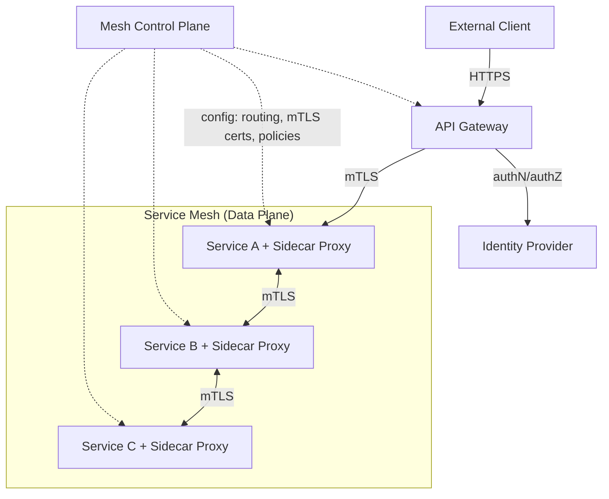
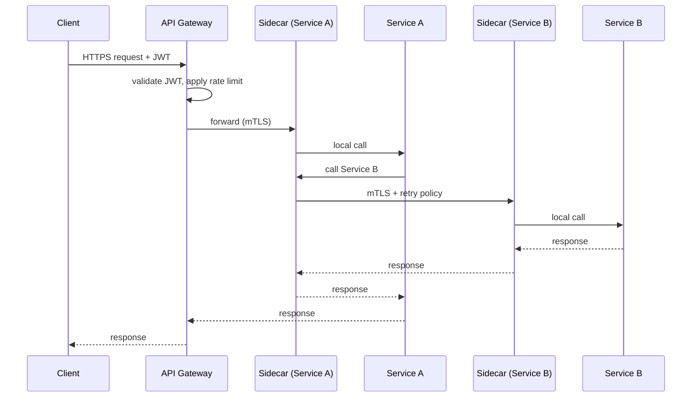
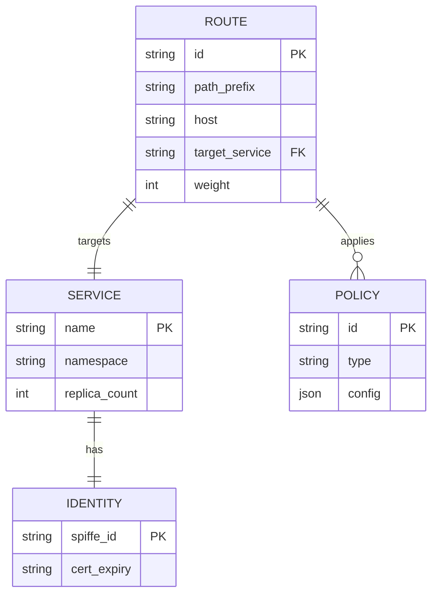

# API Gateway & Service Mesh Architecture

**Version:** 1.0 | **Audience:** Engineering Leadership / Architecture Review

---

## Table of Contents
1. [Executive Summary](#1-executive-summary)
2. [Goals & Non-Goals](#2-goals--non-goals)
3. [High-Level Architecture](#3-high-level-architecture)
4. [Core Components](#4-core-components)
5. [Traffic Flow](#5-traffic-flow)
6. [Data Model / Configuration Model](#6-data-model--configuration-model)
7. [Resilience Patterns](#7-resilience-patterns)
8. [Security Architecture](#8-security-architecture)
9. [Observability Strategy](#9-observability-strategy)
10. [Scalability & Capacity Planning](#10-scalability--capacity-planning)
11. [Technology Stack](#11-technology-stack)
12. [Risks & Mitigations](#12-risks--mitigations)
13. [Future Enhancements](#13-future-enhancements)
14. [Glossary](#14-glossary)

---

## 1. Executive Summary

The **API Gateway** handles north-south traffic (external clients → platform), while the **Service Mesh** handles east-west traffic (service-to-service, inside the cluster). Together they provide a consistent layer for authentication, routing, rate limiting, retries, mTLS, and observability — without every microservice reimplementing this logic.

| Business Driver | How the Architecture Delivers It |
|---|---|
| Consistent security posture | mTLS and authN/authZ enforced uniformly across all services |
| Developer velocity | Cross-cutting concerns (retries, timeouts, rate limiting) handled by infrastructure, not app code |
| Reliability | Circuit breaking and automatic retries contain cascading failures |
| Zero-trust networking | Every service-to-service call is authenticated and encrypted by default |

---

## 2. Goals & Non-Goals

### Functional Goals
- Single entry point for external API traffic with routing, auth, and rate limiting
- Service-to-service traffic secured with automatic mTLS
- Fine-grained traffic control: canary routing, retries, timeouts, circuit breaking
- Centralized observability for all inter-service calls

### Non-Functional Goals
| Attribute | Target |
|---|---|
| Latency overhead | Sidecar proxy adds minimal (<5ms p99) latency |
| Availability | Gateway and mesh control plane are not single points of failure |
| Security | Zero-trust: no unauthenticated/unencrypted service traffic |

### Non-Goals (v1)
- Multi-cluster mesh federation (tracked as future enhancement)
- Full API monetization/billing (handled by a separate system, gateway only meters usage)

---

## 3. High-Level Architecture

**Design principle:** application code makes plain HTTP/gRPC calls to a local sidecar proxy; the proxy handles mTLS, retries, and telemetry transparently — services are unaware the mesh exists.

---

## 4. Core Components

### 4.1 API Gateway
- Edge routing, path/host-based routing to backend services
- AuthN (API key, OAuth2, JWT validation) and coarse-grained authZ
- Rate limiting and quota enforcement per client/API key
- Request/response transformation and API versioning

### 4.2 Sidecar Proxy (Data Plane)
- Deployed alongside every service instance
- Intercepts all inbound/outbound traffic for that service
- Enforces mTLS, applies retry/timeout/circuit-breaker policy, emits telemetry

### 4.3 Mesh Control Plane
- Distributes configuration (routing rules, certificates, policies) to all sidecars
- Issues and rotates short-lived mTLS certificates per service identity
- Central point for defining traffic policies (canary weights, fault injection for testing)

### 4.4 Identity Provider
- Issues and validates tokens (JWT/OAuth2) for external clients
- Backs service identity issuance for mTLS certificates (SPIFFE/SPIRE-style identities)

---

## 5. Traffic Flow

---

## 6. Data Model / Configuration Model

**Policy types:** rate-limit, retry, timeout, circuit-breaker, fault-injection, canary-weight.

---

## 7. Resilience Patterns

| Pattern | Purpose |
|---|---|
| Circuit Breaker | Stop sending traffic to a failing service instance after error threshold, allow it to recover |
| Retry with Backoff | Automatically retry transient failures (idempotent calls only) |
| Timeout | Bound the maximum wait time for any downstream call |
| Bulkhead | Isolate connection pools per downstream dependency so one slow dependency doesn't exhaust all resources |
| Canary Routing | Shift a small % of traffic to a new service version, monitor, then ramp up |
| Fault Injection | Deliberately inject latency/errors in staging to test resilience |

---

## 8. Security Architecture

- **Zero-trust default:** no service-to-service call is trusted without mTLS + verified identity
- **Automatic certificate rotation:** short-lived certs (e.g., 24h) issued per service identity, rotated transparently by the control plane
- **AuthZ policy:** fine-grained per-route/per-service access policy (e.g., "Service A may call Service B's `/read` endpoints only")
- **Gateway-level protections:** WAF rules, DDoS protection, request size limits

---

## 9. Observability Strategy

- **Golden signals per service:** latency, traffic, errors, saturation — captured automatically by the sidecar, no app instrumentation needed
- **Distributed tracing:** trace context automatically propagated by sidecars across every hop
- **Service dependency graph:** auto-generated from real traffic, useful for impact analysis before changes

---

## 10. Scalability & Capacity Planning

| Metric | Guideline |
|---|---|
| Gateway instances | Stateless, horizontally scaled behind a load balancer |
| Sidecar overhead | Budget ~0.1 vCPU / 50–100MB memory per sidecar in capacity planning |
| Control plane | Scale replicas as service count grows; config push latency is the key metric to watch |

---

## 11. Technology Stack

| Component | Suggested Technology |
|---|---|
| API Gateway | Kong, Envoy Gateway, or cloud-native API Gateway |
| Service Mesh | Istio, Linkerd, or Consul Connect |
| Identity | SPIFFE/SPIRE for workload identity |
| Observability | Prometheus, Grafana, Jaeger/Zipkin |

---

## 12. Risks & Mitigations

| Risk | Mitigation |
|---|---|
| Mesh control plane outage | Data plane (sidecars) continues operating on last-known config during control plane downtime |
| Sidecar resource overhead at scale | Right-sized resource requests; consider ambient mesh mode to reduce per-pod sidecar cost |
| Misconfigured retry causing amplification | Retry budgets capped; idempotency required for retryable operations |
| Certificate rotation failure | Alerting on cert expiry approaching; automated renewal well before expiry window |

---

## 13. Future Enhancements

- Multi-cluster mesh federation for global traffic management
- Ambient mesh (sidecar-less) adoption to reduce resource overhead
- Policy-as-code for consistent gateway/mesh policy across environments
- Automatic dependency-aware canary rollout gating

---

## 14. Glossary

| Term | Definition |
|---|---|
| North-South Traffic | Traffic between external clients and the platform |
| East-West Traffic | Traffic between internal services |
| Sidecar Proxy | Per-instance proxy handling network concerns transparently |
| mTLS | Mutual TLS — both client and server authenticate each other |
| Circuit Breaker | Pattern that stops calls to a failing dependency temporarily |

---
*End of document.*
