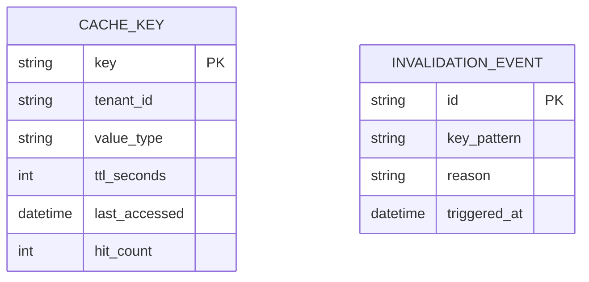
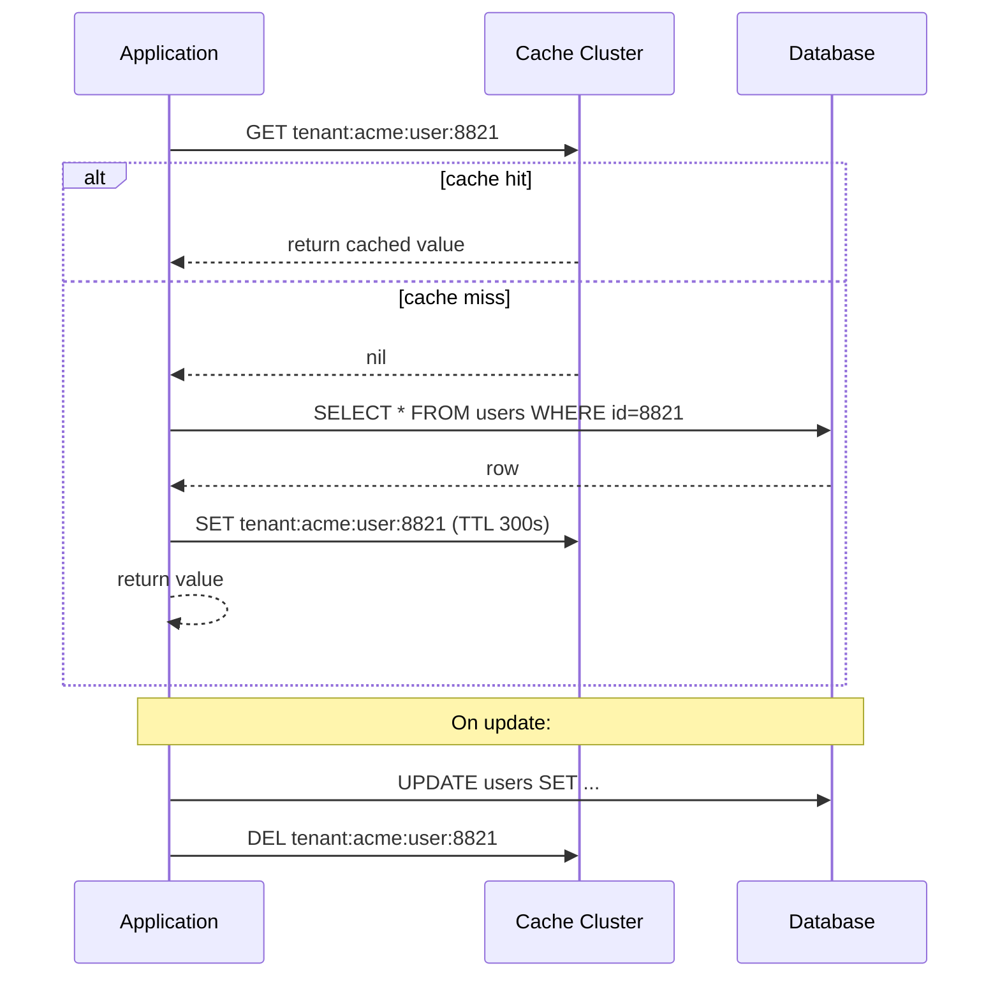

# Distributed Caching Layer Architecture

**Version:** 1.0 | **Audience:** Engineering Leadership / Architecture Review

---

## Table of Contents
1. [Executive Summary](#1-executive-summary)
2. [Goals & Non-Goals](#2-goals--non-goals)
3. [High-Level Architecture](#3-high-level-architecture)
4. [Core Components](#4-core-components)
5. [Caching Patterns](#5-caching-patterns)
6. [Data Model](#6-data-model)
7. [Read/Write Workflow](#7-readwrite-workflow)
8. [Consistency & Invalidation Strategy](#8-consistency--invalidation-strategy)
9. [Failure Recovery](#9-failure-recovery)
10. [Security Architecture](#10-security-architecture)
11. [Scalability & Capacity Planning](#11-scalability--capacity-planning)
12. [Observability Strategy](#12-observability-strategy)
13. [Technology Stack](#13-technology-stack)
14. [Risks & Mitigations](#14-risks--mitigations)
15. [Future Enhancements](#15-future-enhancements)
16. [Glossary](#16-glossary)

---

## 1. Executive Summary

A **distributed caching layer** sits between application services and the primary datastore to absorb read load, reduce latency, and protect the database from traffic spikes. This document covers the caching topology, invalidation strategy, and failure-handling approach for a horizontally scaled, multi-tenant caching tier.

| Business Driver | How the Architecture Delivers It |
|---|---|
| Latency reduction | Sub-millisecond reads for hot data vs. database round-trips |
| Database protection | Absorbs read-heavy traffic, preventing primary DB overload |
| Cost efficiency | Cheaper to scale cache nodes than database read replicas for hot-key workloads |
| Availability | Cache-aside pattern degrades gracefully — cache miss just falls through to DB |

---

## 2. Goals & Non-Goals

### Functional Goals
- Provide sub-millisecond reads for frequently accessed data
- Support consistent-hashing based horizontal scaling of cache nodes
- Provide clear invalidation strategy to bound staleness
- Support both simple key-value caching and more complex structures (sorted sets, hashes)

### Non-Functional Goals
| Attribute | Target |
|---|---|
| Availability | Cache node failure does not cause application failure (fail open to DB) |
| Consistency | Bounded staleness window, explicit per-use-case tradeoff |
| Multi-tenancy | Tenant-prefixed keys, per-tenant memory quotas |

### Non-Goals (v1)
- Strong (linearizable) consistency across cache and database — cache is explicitly eventually-consistent
- Using the cache as a system of record for any data

---

## 3. High-Level Architecture

```mermaid
flowchart TD
    App["Application Service"]
    Client["Cache Client (consistent hashing)"]
    Node1["Cache Node 1"]
    Node2["Cache Node 2"]
    Node3["Cache Node N"]
    DB["Primary Database"]
    PubSub["Invalidation Pub/Sub"]

    App --> Client
    Client -->|hash(key)| Node1
    Client -->|hash(key)| Node2
    Client -->|hash(key)| Node3

    App -->|on miss| DB
    DB -->|write-through / invalidate| PubSub
    PubSub --> Node1
    PubSub --> Node2
    PubSub --> Node3
```

**Design principle:** the cache is always a **derived, disposable** view of the database — it can be flushed entirely and rebuilt from source without data loss. This is what makes the "fail open to DB on cache miss/outage" strategy safe.

---

## 4. Core Components

### 4.1 Cache Client Library
- Implements consistent hashing to map keys to cache nodes
- Handles node failure detection and automatic re-hashing/failover
- Enforces tenant-prefixed key convention and TTL defaults

### 4.2 Cache Nodes
- In-memory key-value stores, clustered with replication for HA
- Support eviction policies (LRU/LFU) when memory limits are reached

### 4.3 Invalidation Pub/Sub
- Broadcasts invalidation events when underlying data changes
- Ensures all cache nodes/replicas drop stale entries promptly rather than waiting for TTL expiry

### 4.4 Write-Through / Write-Behind Layer (optional)
- For write-heavy hot keys, writes go to cache first and asynchronously flush to the database, reducing write amplification

---

## 5. Caching Patterns

| Pattern | Description | Best For |
|---|---|---|
| **Cache-Aside (Lazy Loading)** | App checks cache; on miss, reads DB and populates cache | General-purpose, most common |
| **Read-Through** | Cache itself is responsible for loading from DB on miss | Simplifies app code, cache library handles it |
| **Write-Through** | Writes go to cache and DB synchronously | Strong read-after-write consistency for cached data |
| **Write-Behind** | Writes go to cache immediately, DB updated asynchronously | High write throughput, some durability risk |
| **Refresh-Ahead** | Proactively refresh hot keys before TTL expiry | Avoids latency spike on expiry of very hot keys |

---

## 6. Data Model



**Key naming convention:** `tenant:{tenant_id}:{entity}:{id}` — e.g., `tenant:acme:user:8821`.

---

## 7. Read/Write Workflow



---

## 8. Consistency & Invalidation Strategy

| Strategy | Staleness Bound | Notes |
|---|---|---|
| TTL-only expiry | Up to TTL duration | Simplest, no invalidation infra needed |
| Explicit invalidation on write | Near-zero (pub/sub propagation delay) | Requires write-path discipline to always invalidate |
| Version-stamped keys | Zero (new version = new key) | Old versions naturally expire via TTL, no explicit delete needed |

**Recommended default:** explicit invalidation on write + a conservative TTL as a safety net for any missed invalidation path.

---

## 9. Failure Recovery

| Scenario | Behavior |
|---|---|
| Cache node failure | Consistent hashing reroutes affected keys to remaining nodes; some cache misses temporarily, no application failure |
| Full cache cluster outage | Application fails open — all reads fall through to database (with rate-limiting/circuit-breaker to protect DB from the sudden load spike) |
| Invalidation event lost | TTL safety net bounds maximum staleness even if pub/sub delivery fails |
| Thundering herd on hot key expiry | Refresh-ahead pattern or request coalescing (single in-flight DB read per key, others wait) |

---

## 10. Security Architecture

- Cache cluster network-isolated (private subnet, no public exposure)
- AuthN required for cache client connections (password/ACL-based)
- Sensitive data either not cached, or cached encrypted, based on data classification policy
- Tenant-prefixed keys prevent cross-tenant data leakage within a shared cache cluster

---

## 11. Scalability & Capacity Planning

| Metric | Guideline |
|---|---|
| Node count | Scale horizontally via consistent hashing; add nodes as memory pressure grows |
| Hot-key detection | Monitor per-key access frequency to identify candidates for refresh-ahead or client-side local caching |
| Memory sizing | Size for working-set (hot data), not full dataset — cache is not meant to hold everything |
| Replication factor | Replica per shard for HA; failover without full cache rebuild |

---

## 12. Observability Strategy

- **Cache hit ratio** (per key pattern/tenant) is the primary health metric
- Eviction rate, memory utilization, and per-node latency tracked continuously
- Alerting when hit ratio drops sharply (signals invalidation storm or cold cache after failover)

---

## 13. Technology Stack

| Component | Suggested Technology |
|---|---|
| Cache Engine | Redis (Cluster mode) or Memcached |
| Pub/Sub for invalidation | Redis Pub/Sub or Kafka |
| Client Library | Language-native Redis client with consistent-hashing support |
| Monitoring | Prometheus + Grafana, Redis Exporter |

---

## 14. Risks & Mitigations

| Risk | Mitigation |
|---|---|
| Stale data served after write | Explicit invalidation on write + short TTL safety net |
| Thundering herd on cache-cluster restart | Gradual warm-up, request coalescing, DB rate-limiting during recovery |
| Hot key overloading single node | Client-side local caching layer for extremely hot keys |
| Cache used as source of truth by mistake | Architectural review gate; cache always rebuildable from DB by design |

---

## 15. Future Enhancements

- Multi-tier caching (local in-process cache + distributed cache)
- Predictive pre-warming based on traffic pattern forecasting
- Automatic hot-key detection and mitigation
- Cross-region cache replication for global low-latency reads

---

## 16. Glossary

| Term | Definition |
|---|---|
| Cache-Aside | Application-managed caching pattern: check cache, fall back to DB on miss |
| TTL | Time-to-live; duration after which a cached entry expires |
| Thundering Herd | Many concurrent requests hitting the DB simultaneously after a cache miss/expiry |
| Consistent Hashing | Hashing scheme that minimizes key remapping when nodes are added/removed |
| Hot Key | A cache key receiving disproportionately high traffic |

---
*End of document.*
