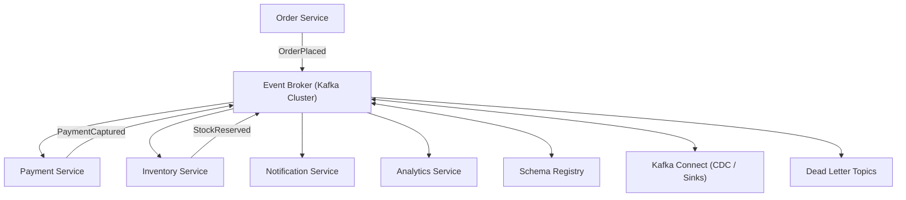
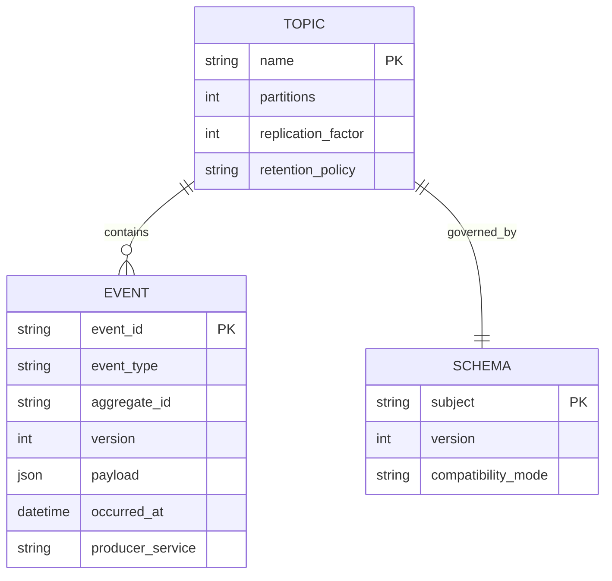
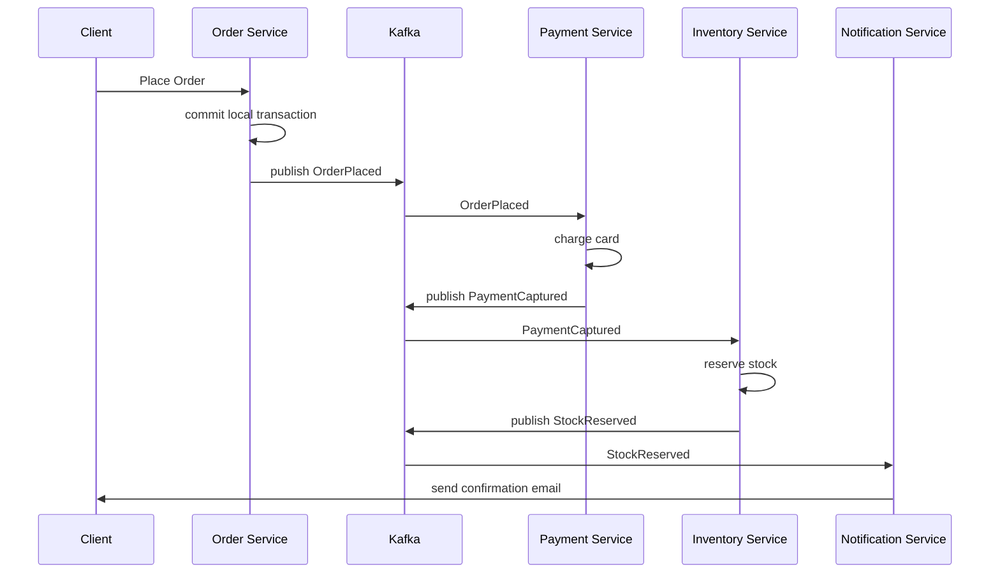

# Event-Driven Microservices Architecture (Kafka-based)

**Version:** 1.0 | **Audience:** Engineering Leadership / Architecture Review

---

## Table of Contents
1. [Executive Summary](#1-executive-summary)
2. [Goals & Non-Goals](#2-goals--non-goals)
3. [High-Level Architecture](#3-high-level-architecture)
4. [Core Components](#4-core-components)
5. [Data Model & Event Contracts](#5-data-model--event-contracts)
6. [End-to-End Workflow](#6-end-to-end-workflow)
7. [Failure Recovery & Delivery Guarantees](#7-failure-recovery--delivery-guarantees)
8. [Security Architecture](#8-security-architecture)
9. [Scalability & Capacity Planning](#9-scalability--capacity-planning)
10. [Observability Strategy](#10-observability-strategy)
11. [Technology Stack](#11-technology-stack)
12. [Risks & Mitigations](#12-risks--mitigations)
13. [Future Enhancements](#13-future-enhancements)
14. [Glossary](#14-glossary)

---

## 1. Executive Summary

An **event-driven microservices architecture** decouples services by communicating through immutable, durable events on a distributed log (Kafka) rather than direct synchronous calls. Services publish facts about what happened ("OrderPlaced", "PaymentCaptured") and other services react independently — enabling teams to scale, deploy, and fail independently while maintaining a consistent, replayable system-wide history.

| Business Driver | How the Architecture Delivers It |
|---|---|
| Team autonomy | Services own their data and publish events; no shared database coupling |
| Resilience | Async processing means a downstream outage doesn't cascade upstream |
| Auditability | The event log is a durable, replayable record of everything that happened |
| Scalability | Producers/consumers scale independently via partitioned topics |
| New feature velocity | New consumers can subscribe to existing event streams without touching producers |

---

## 2. Goals & Non-Goals

### Functional Goals
- Decouple services via a durable, partitioned event log
- Guarantee at-least-once delivery with idempotent consumers
- Support event replay for new consumers and disaster recovery
- Provide schema governance and backward/forward compatibility
- Enable both event notification and event-carried state transfer patterns

### Non-Functional Goals
| Attribute | Target |
|---|---|
| Durability | Events persisted with configurable replication factor |
| Ordering | Per-key ordering guaranteed within a partition |
| Fault tolerance | No single broker failure causes data loss |
| Multi-tenancy | Topic-level access control per team/domain |

### Non-Goals (v1)
- Exactly-once semantics across heterogeneous external systems (only within Kafka-native transactions)
- Cross-region synchronous replication (async mirroring only)

---

## 3. High-Level Architecture



**Design principle:** producers never know their consumers. All coordination happens through well-defined, versioned event schemas on named topics — the topic contract *is* the integration contract.

---

## 4. Core Components

### 4.1 Event Broker (Kafka Cluster)
- Partitioned, replicated, append-only log per topic
- Partition key determines ordering guarantee (e.g., `order_id` keeps all events for an order in order)
- Retention configurable per topic (time-based or compacted for latest-state topics)

### 4.2 Schema Registry
- Enforces Avro/Protobuf schema compatibility (backward/forward) before a producer can publish
- Prevents a schema change from breaking existing consumers
- Versioned schema history per topic

### 4.3 Producers & Consumers
- **Producers** publish domain events after committing their own local transaction (transactional outbox pattern to avoid dual-write inconsistency)
- **Consumers** are independently scalable consumer groups; each group tracks its own offset
- Consumers must be **idempotent** — the same event may be delivered more than once

### 4.4 Kafka Connect / CDC
- Change-Data-Capture connectors stream database changes into Kafka without application code changes
- Sink connectors deliver events into data warehouses, search indexes, or caches

### 4.5 Dead Letter Topics
- Events that repeatedly fail consumer processing are routed to a DLQ for manual inspection/replay, rather than blocking the partition

---

## 5. Data Model & Event Contracts



**Event envelope convention**
```json
{
  "event_id": "evt_9a21",
  "event_type": "OrderPlaced",
  "aggregate_id": "order_4471",
  "version": 1,
  "occurred_at": "2026-08-06T10:02:00Z",
  "producer_service": "order-service",
  "payload": { "order_id": "order_4471", "total": 249.00, "currency": "USD" }
}
```

---

## 6. End-to-End Workflow



---

## 7. Failure Recovery & Delivery Guarantees

| Scenario | Behavior |
|---|---|
| Consumer crashes mid-processing | Offset not committed → event redelivered on restart (at-least-once) |
| Duplicate event delivery | Idempotent consumer logic (dedupe by `event_id`) prevents double-processing |
| Broker node failure | Partition leader election promotes an in-sync replica; no data loss with `acks=all` |
| Poison message (repeated failure) | Routed to Dead Letter Topic after N retries; alerts fired |
| Downstream service fully down | Events queue in the topic (bounded by retention); consumer catches up on recovery |

---

## 8. Security Architecture

- **Authentication:** mTLS or SASL between clients and brokers
- **Authorization:** ACLs per topic (who can produce/consume), enforced at the broker
- **Encryption:** TLS in transit; encryption at rest for broker storage
- **PII handling:** sensitive fields tokenized/encrypted at the payload level before publishing; schema registry can flag PII fields for governance

---

## 9. Scalability & Capacity Planning

| Metric | Guideline |
|---|---|
| Partition count | Sized for target consumer parallelism (1 partition = 1 concurrent consumer per group) |
| Broker scaling | Add brokers + rebalance partitions as throughput grows |
| Consumer group scaling | Add consumer instances up to partition count for linear throughput scaling |
| Retention sizing | Balance replay window needs vs. storage cost |

---

## 10. Observability Strategy

- **Consumer lag** per group/topic is the primary early-warning metric
- **End-to-end tracing** via correlation IDs propagated in event headers
- Dashboards: throughput (events/sec), consumer lag, DLQ volume, schema compatibility violations

---

## 11. Technology Stack

| Component | Suggested Technology |
|---|---|
| Broker | Apache Kafka / Confluent / Redpanda |
| Schema Registry | Confluent Schema Registry |
| CDC | Debezium |
| Stream Processing | Kafka Streams / Flink |
| Monitoring | Prometheus + Grafana, Kafka Exporter |

---

## 12. Risks & Mitigations

| Risk | Mitigation |
|---|---|
| Schema-breaking change | Enforced compatibility checks in Schema Registry before publish |
| Consumer lag growth | Autoscaling consumer groups on lag-based metrics |
| Event ordering violated | Consistent partition key selection strategy documented per topic |
| Data duplication downstream | Idempotency keys enforced at every consumer boundary |

---

## 13. Future Enhancements

- Stream processing layer (Flink/Kafka Streams) for real-time aggregation
- Exactly-once semantics for Kafka-native pipelines
- Multi-region topic mirroring for DR
- Event schema catalog with self-service discovery UI

---

## 14. Glossary

| Term | Definition |
|---|---|
| Topic | Named, partitioned event log |
| Consumer Group | Set of consumer instances sharing partition assignment |
| Offset | Position of a consumer within a partition |
| Outbox Pattern | Writing an event to a local table in the same transaction as business data, then relaying to Kafka |
| DLQ | Dead Letter Queue/Topic for repeatedly failing events |

---
*End of document.*
