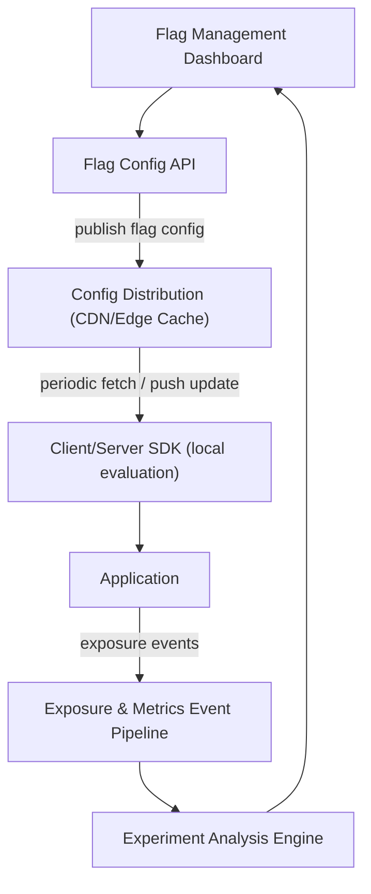
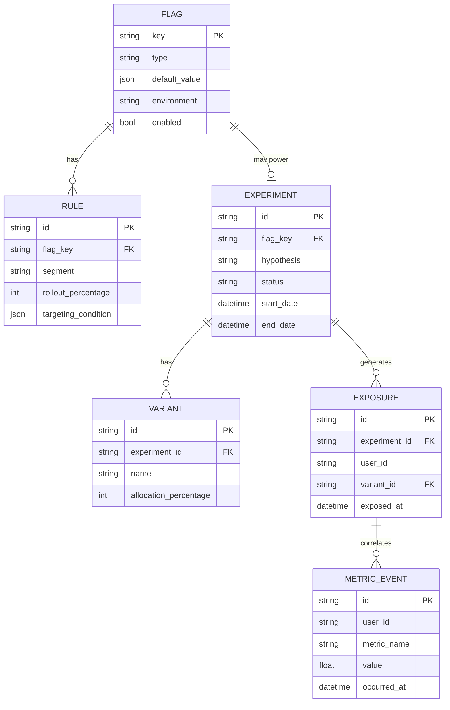
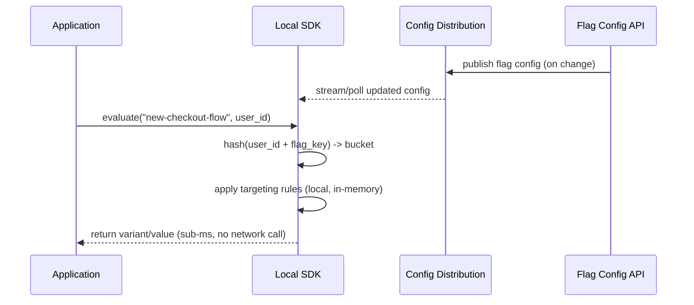
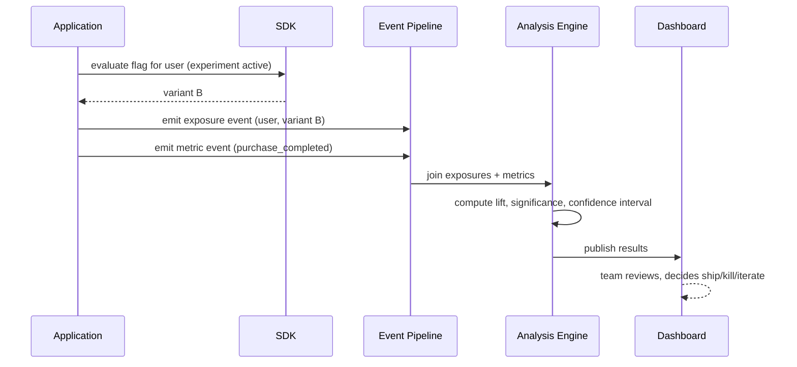

# Feature Flag & Experimentation Platform Architecture

**Version:** 1.0 | **Audience:** Engineering Leadership / Architecture Review

---

## Table of Contents
1. [Executive Summary](#1-executive-summary)
2. [Goals & Non-Goals](#2-goals--non-goals)
3. [High-Level Architecture](#3-high-level-architecture)
4. [Core Components](#4-core-components)
5. [Data Model](#5-data-model)
6. [Flag Evaluation Workflow](#6-flag-evaluation-workflow)
7. [Experimentation Workflow](#7-experimentation-workflow)
8. [Failure Recovery & Availability](#8-failure-recovery--availability)
9. [Security Architecture](#9-security-architecture)
10. [Scalability & Capacity Planning](#10-scalability--capacity-planning)
11. [Observability Strategy](#11-observability-strategy)
12. [Technology Stack](#12-technology-stack)
13. [Risks & Mitigations](#13-risks--mitigations)
14. [Future Enhancements](#14-future-enhancements)
15. [Glossary](#15-glossary)

---

## 1. Executive Summary

The **feature flag & experimentation platform** decouples code deployment from feature release. Flags let teams ship dark, roll out gradually, target specific user segments, and instantly kill a broken feature without a redeploy. Layered on top, the experimentation engine turns flags into controlled A/B tests with statistically rigorous analysis of business-metric impact.

| Business Driver | How the Architecture Delivers It |
|---|---|
| Decoupled deploy & release | Ship code dark, release via flag flip — no redeploy needed to launch or kill a feature |
| Risk mitigation | Instant kill-switch for a broken feature, no rollback deploy required |
| Data-driven decisions | Built-in A/B testing turns every rollout into a measurable experiment |
| Targeted rollouts | Percentage rollout, user segment targeting, and gradual ramp-up |

---

## 2. Goals & Non-Goals

### Functional Goals
- Evaluate feature flags with low latency at the edge (client SDK, no network call per evaluation)
- Support boolean, multivariate, and percentage-rollout flags
- Support user/segment targeting rules
- Run A/B experiments with randomized bucketing and statistical significance analysis
- Provide instant, global kill-switch capability

### Non-Functional Goals
| Attribute | Target |
|---|---|
| Evaluation latency | Sub-millisecond, local SDK evaluation (no per-request network call) |
| Consistency | A given user consistently sees the same variant for a flag's duration |
| Availability | Flag service outage does not break the application (SDK falls back to last-known config or defaults) |
| Multi-tenancy | Per-project/environment flag isolation |

### Non-Goals (v1)
- Full statistical experimentation platform replacing dedicated data science tooling for advanced causal inference
- Client-side flag evaluation for highly sensitive business logic (server-side evaluation recommended for those cases)

---

## 3. High-Level Architecture

**Design principle:** flag configuration is distributed to a **local SDK cache**, so every evaluation is a local, in-memory lookup — the flag service being temporarily unreachable never adds latency or risk to the request path.

---

## 4. Core Components

### 4.1 Flag Management Dashboard
- UI for creating flags, defining targeting rules, and setting rollout percentages
- Approval workflow for production flag changes (especially kill-switches and 100% rollouts)

### 4.2 Flag Config API
- Source of truth for flag definitions, targeting rules, and experiment configuration
- Versioned config publishing so changes can be audited and reverted

### 4.3 Config Distribution Layer
- Pushes/streams flag configuration to SDKs via CDN edge caching or a streaming connection (SSE/WebSocket)
- Ensures global propagation of a flag change within seconds

### 4.4 Client/Server SDK
- Caches the full flag configuration locally
- Evaluates flags in-process using consistent hashing on a stable user identifier — guarantees the same user always gets the same bucket for a given flag/experiment
- Falls back to a configured default value if config is stale/unavailable

### 4.5 Exposure & Metrics Event Pipeline
- Records which variant each user was exposed to, and downstream business-metric events
- Feeds the experiment analysis engine

### 4.6 Experiment Analysis Engine
- Joins exposure events with business metrics (conversion, revenue, engagement)
- Computes statistical significance and confidence intervals per variant

---

## 5. Data Model

---

## 6. Flag Evaluation Workflow

---

## 7. Experimentation Workflow

---

## 8. Failure Recovery & Availability

| Scenario | Behavior |
|---|---|
| Flag Config API outage | SDKs continue using last successfully cached config — zero application impact |
| Config distribution delay | Flag change propagation delayed but bounded (typically seconds); not a hard dependency for request serving |
| SDK fails to load config on startup | Falls back to hardcoded default values shipped with the SDK initialization |
| Event pipeline backlog | Exposure/metric events buffered and processed asynchronously; does not block application requests |

---

## 9. Security Architecture

- Flag Config API requires authenticated, environment-scoped API keys (dev/staging/prod isolation)
- Production flag changes (especially kill-switches) require role-based approval in the dashboard
- Sensitive flags (e.g., internal-only features) restricted via server-side-only evaluation, never shipped to client SDKs
- Full audit log of every flag change: who, when, what changed, and why (linked change reason/ticket)

---

## 10. Scalability & Capacity Planning

| Metric | Guideline |
|---|---|
| Config payload size | Kept small via environment-scoped config splitting as flag count grows |
| SDK evaluation load | Zero network cost per evaluation — scales with application traffic at no additional platform load |
| Event pipeline throughput | Sized for peak exposure-event volume across all active experiments |
| Config propagation latency | Target sub-few-seconds global propagation for kill-switch scenarios |

---

## 11. Observability Strategy

- Flag evaluation counts and variant distribution per flag (sanity-check that rollout percentages match actual traffic split)
- Experiment health dashboards: sample ratio mismatch detection (an early warning that bucketing is broken)
- Config propagation latency tracked as a key platform SLO, especially for kill-switch use cases

---

## 12. Technology Stack

| Component | Suggested Technology |
|---|---|
| Flag Config Store | PostgreSQL / DynamoDB |
| Config Distribution | CDN edge caching or SSE/streaming service |
| SDKs | Language-specific client libraries with local evaluation |
| Event Pipeline | Kafka |
| Analysis Engine | Batch/stream processing (Spark/Flink) + statistics library |

---

## 13. Risks & Mitigations

| Risk | Mitigation |
|---|---|
| Flag left on indefinitely, becomes tech debt | Flag lifecycle policy: stale-flag detection and mandatory cleanup after full rollout |
| Sample ratio mismatch invalidates experiment | Automated SRM detection alerts before results are trusted |
| Kill-switch doesn't propagate fast enough | SLO-monitored propagation latency; push-based (not poll-only) distribution for critical flags |
| Too many overlapping experiments interfere | Mutual exclusion groups / layering to prevent conflicting experiments on the same users |

---

## 14. Future Enhancements

- Multi-armed bandit allocation for faster convergence on winning variants
- Automated guardrail metrics that auto-pause an experiment on regression
- Feature flag dependency graph visualization
- Server-side + client-side evaluation consistency guarantees for hybrid apps

---

## 15. Glossary

| Term | Definition |
|---|---|
| Feature Flag | A runtime toggle controlling whether a code path is active |
| Kill Switch | A flag used to instantly disable a feature without a redeploy |
| Bucketing | Deterministically assigning a user to a variant based on a stable hash |
| Sample Ratio Mismatch (SRM) | When observed variant traffic split significantly deviates from configured allocation, signaling a bucketing bug |
| Exposure Event | Record of a user being shown a specific flag/experiment variant |

---
*End of document.*
