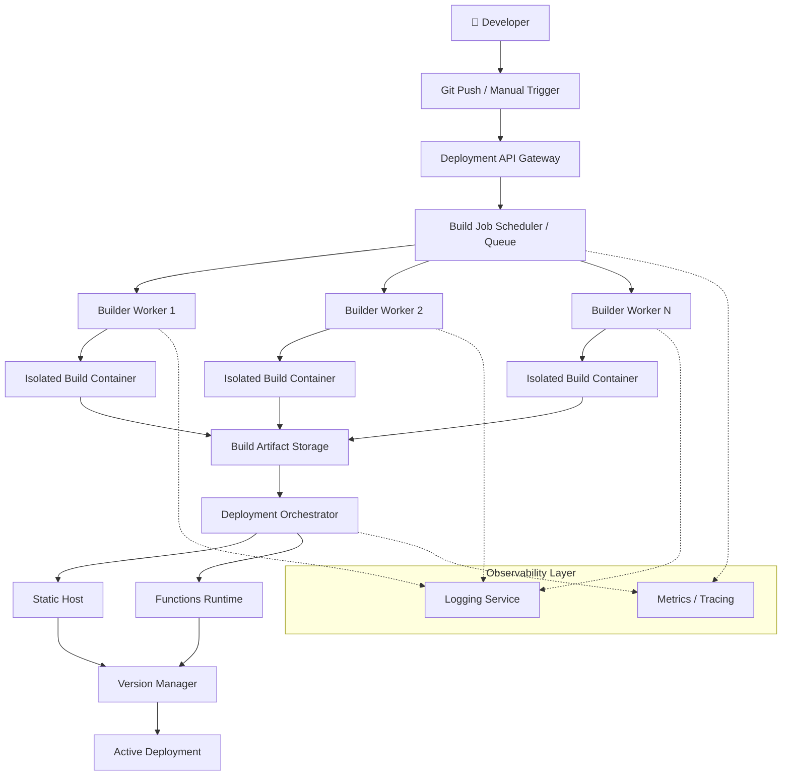
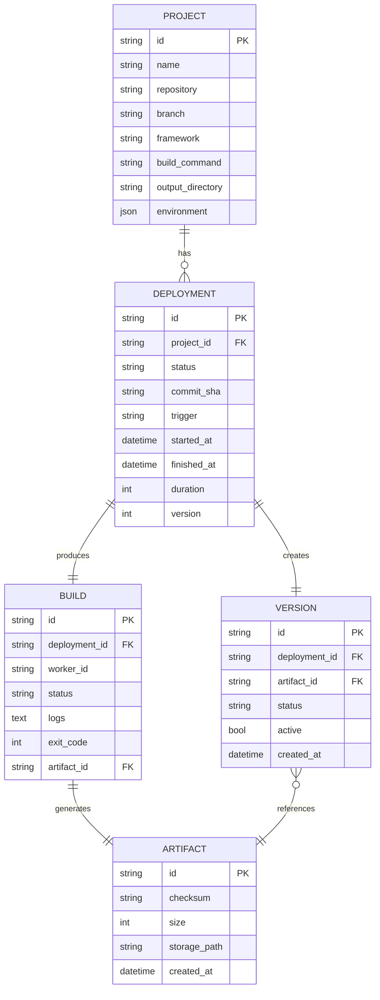

# Build & Deploy System — Architecture Design Document

**System Type:** Appwrite-style CI/CD & Deployment Platform
**Audience:** Engineering Leadership / Management Review
**Status:** Draft for Review
**Version:** 2.0 (Expanded)

---

## Table of Contents

1. [Executive Summary](#1-executive-summary)
2. [Goals & Non-Goals](#2-goals--non-goals)
3. [High-Level Architecture](#3-high-level-architecture)
4. [Core Services — Detailed Design](#4-core-services--detailed-design)
5. [Data Model](#5-data-model)
6. [End-to-End Deployment Workflow](#6-end-to-end-deployment-workflow)
7. [Failure Recovery & Resilience](#7-failure-recovery--resilience)
8. [Security Architecture](#8-security-architecture)
9. [Multi-Tenancy Design](#9-multi-tenancy-design)
10. [Scalability & Capacity Planning](#10-scalability--capacity-planning)
11. [Observability Strategy](#11-observability-strategy)
12. [SLAs, SLOs & Reliability Targets](#12-slas-slos--reliability-targets)
13. [Technology Stack](#13-technology-stack)
14. [Cost Considerations](#14-cost-considerations)
15. [Rollout Plan](#15-rollout-plan)
16. [Risks & Mitigations](#16-risks--mitigations)
17. [Future Enhancements](#17-future-enhancements)
18. [Glossary](#18-glossary)

---

## 1. Executive Summary

The **Build & Deploy System** is the platform that turns a developer's source code into a running, versioned, publicly reachable application — automatically, securely, and at scale. It mirrors the deployment experience of platforms like Vercel, Netlify, and Appwrite: push code, get a build, get a live URL, and roll back instantly if something breaks.

**Why this matters for the business:**

| Business Driver | How the System Delivers It |
|---|---|
| Faster time-to-market | Fully automated Git-to-production pipeline, no manual ops involvement |
| Developer productivity | Self-service deploys, live logs, instant rollback |
| Reliability | Immutable versioned artifacts + health-checked promotion |
| Cost control | Ephemeral, auto-scaled build workers; pay only for active usage |
| Compliance & security | Isolated builds, secret injection at runtime only, full audit trail |

This document describes the architecture, service boundaries, data model, security posture, scaling strategy, and rollout plan for engineering and technical stakeholders.

---

## 2. Goals & Non-Goals

### 2.1 Functional Goals

- Connect to Git providers (GitHub, GitLab, Bitbucket) via OAuth + webhooks
- Trigger builds automatically on push, PR, or manual request
- Execute builds in fully isolated, ephemeral environments
- Store immutable, checksummed build artifacts
- Deploy artifacts to static hosting and serverless function runtimes
- Support deployment versioning with full history
- One-click rollback to any previous version
- Real-time build and deployment log streaming
- Horizontal scalability of build and deploy capacity

### 2.2 Non-Functional Goals

| Attribute | Target |
|---|---|
| Scalability | Linear scale-out of workers with queue depth |
| Fault tolerance | No single point of failure in the critical path |
| Security | Zero secret leakage into artifacts; strict build isolation |
| Multi-tenancy | Hard isolation between organizations/projects |
| Observability | End-to-end tracing from webhook to active deployment |
| Cost efficiency | Ephemeral compute; no idle build capacity billed |

### 2.3 Explicit Non-Goals (v1)

- Multi-region active-active deployment (tracked as future enhancement)
- Built-in APM for deployed customer applications
- Native support for non-containerized legacy build systems

---

## 3. High-Level Architecture



**Design principle:** every stage in the pipeline is a stateless, independently scalable service communicating through a durable queue and immutable storage — so any component can fail, restart, or scale without corrupting deployment state.

---

## 4. Core Services — Detailed Design

### 4.1 Deployment API

**Responsibilities**
- Accept deployment requests (Git webhook or manual trigger)
- Authenticate and authorize the caller (JWT / API key / OAuth)
- Validate repository and project configuration
- Persist a `Deployment` record
- Publish a build job onto the queue

**API Surface**

```
POST   /v1/deployments                 Create a deployment
POST   /v1/deployments/{id}/cancel     Cancel an in-progress deployment
GET    /v1/deployments/{id}            Get deployment status/details
GET    /v1/deployments                 List deployments (paginated, filterable)
GET    /v1/deployments/{id}/logs       Stream or fetch logs
POST   /v1/deployments/{id}/rollback   Roll back to this deployment's version
```

**Example: Create Deployment**

```http
POST /v1/deployments
Authorization: Bearer <jwt>
Content-Type: application/json

{
  "project_id": "proj_8f2c",
  "commit_sha": "a1b2c3d",
  "branch": "main",
  "trigger": "webhook"
}
```

```json
{
  "id": "dep_9f13",
  "status": "queued",
  "project_id": "proj_8f2c",
  "commit_sha": "a1b2c3d",
  "created_at": "2026-08-06T09:15:00Z"
}
```

**Key design decisions**
- API is fully stateless → horizontally scalable behind a load balancer
- Idempotency keys on `POST /deployments` prevent duplicate builds from webhook retries
- Rate limiting per project to prevent abuse/runaway triggers

---

### 4.2 Build Scheduler

**Responsibilities**
- Queue management (FIFO per project, priority across projects)
- Retry handling with exponential backoff
- Priority scheduling (manual/production deploys can preempt low-priority preview builds)
- Worker assignment based on resource availability and build size

**Input → Output**

```
Deployment Request  →  Build Job (queued message: project config, commit ref, build command, resource profile)
```

**Scheduling policies**
- **Fairness:** per-tenant concurrency caps prevent one noisy project from starving others
- **Priority tiers:** `production` > `manual` > `preview/PR`
- **Backpressure:** queue depth is a first-class scaling signal (see §10)

---

### 4.3 Build Worker

**Responsibilities**
- Clone repository at the specified commit
- Download source and resolve dependencies
- Prepare an isolated build environment
- Execute the configured build command
- Package output into an artifact
- Upload artifact to storage
- Stream logs in real time to the Logging Service

**Build Lifecycle State Machine**

```
Queued → Preparing → Downloading Source → Installing Dependencies
       → Building → Packaging → Uploading Artifact → Completed
```

Each state transition emits an event consumed by the Logging Service and Observability layer, enabling real-time progress in the UI.

**Timeout & retry policy:** each stage has a configurable timeout (default 15 min for install, 20 min for build); on transient infra failure the job is retried up to 2 times before being marked `failed`.

---

### 4.4 Build Environment (Isolation Layer)

**Implementation options (in increasing isolation strength)**

| Option | Isolation | Startup Time | Use Case |
|---|---|---|---|
| Docker Container | Namespace/cgroup | Fast (~1–2s) | Trusted internal builds |
| Kubernetes Job/Pod | Namespace/cgroup + K8s policies | Fast | Standard workload, easy orchestration |
| Firecracker microVM | Hardware-level VM isolation | ~125ms | Multi-tenant untrusted code (recommended) |

**Responsibilities**
- Full resource isolation (CPU/memory/disk quotas per build)
- Network policy: default-deny egress except allow-listed package registries
- Ephemeral, read-only base image with a temporary writable overlay
- Guaranteed cleanup/destruction after job completion (no state persists between builds)

**Build pipeline inside the environment**

```
Builder Base Image → Language Runtime (Node/Python/Go/...) 
  → Install Dependencies → Run Build Command → Produce dist/ output
```

---

### 4.5 Artifact Storage

**Supported artifact types:** ZIP, TAR, OCI Image, Directory Snapshot

**Metadata tracked per artifact**

```
Artifact ID
Checksum (SHA-256)
Size
Build ID (provenance)
Timestamp
Retention Policy
```

**Design notes**
- Artifacts are **immutable** once written — never modified in place, only superseded by a new version
- Checksums are verified on both upload and download to detect corruption
- Retention policies allow automatic expiry of old preview-branch artifacts to control storage cost
- Backed by S3-compatible object storage with CDN in front for fast global distribution

---

### 4.6 Deployment Orchestrator

**Responsibilities**
- Download and checksum-verify the artifact
- Provision/update the target runtime (static host or functions runtime)
- Run post-deploy health checks
- Activate the new version only after checks pass

**Deployment State Machine**

```
Pending → Deploying → Verifying → Active → Archived
```

If **Verifying** fails, the orchestrator automatically triggers rollback (see §7.2) rather than leaving a broken version live.

---

### 4.7 Version Manager

**Responsibilities**
- Maintain a complete, immutable history of every deployed version per project
- Guarantee exactly **one active version** per environment at any time
- Execute atomic traffic switches between versions

```
Version 1 → Version 2 → Version 3 → Version 4 (active)
```

**Rollback flow**

```
Current Active Version
   ↓
Operator Selects Previous Version
   ↓
Activate Previous Version (artifact already stored — no rebuild needed)
   ↓
Atomic Traffic Switch
```

Because artifacts are immutable and retained, rollback is **near-instant** — it is a routing change, not a rebuild.

---

### 4.8 Logging Service

**Collects:** build logs, deployment logs, system/infra logs

**Features**
- Live streaming (WebSocket/SSE) during active builds
- Full-text search across historical logs
- Downloadable log archives
- Configurable retention per plan tier

---

## 5. Data Model

### 5.1 Entity Relationship Overview



### 5.2 Field Notes

- `Project.environment` stores encrypted key-value environment variables, injected only at build/deploy time (never persisted in the artifact).
- `Deployment.trigger` ∈ `{webhook, manual, rollback, api}` for audit purposes.
- `Version.active` is enforced unique-true-per-project at the database constraint level to prevent two simultaneously active versions.

---

## 6. End-to-End Deployment Workflow

```mermaid
sequenceDiagram
    participant Dev as Developer
    participant Git as Git Provider
    participant API as Deployment API
    participant Q as Build Scheduler/Queue
    participant W as Build Worker
    participant AS as Artifact Storage
    participant O as Deployment Orchestrator
    participant VM as Version Manager

    Dev->>Git: git push
    Git->>API: webhook event
    API->>API: authenticate + validate
    API->>Q: enqueue build job
    Q->>W: assign job to worker
    W->>Git: clone repository @ commit
    W->>W: install deps + run build
    W->>AS: upload artifact (checksum)
    W->>O: notify build complete
    O->>AS: download + verify artifact
    O->>O: deploy to runtime
    O->>O: run health checks
    O->>VM: activate new version
    VM->>VM: atomic traffic switch
    VM-->>Dev: deployment live (notification)

---

## 7. Failure Recovery & Resilience

### 7.1 Build Failure

```
Queued → Building → Compilation Error → Logs Stored → Deployment Failed
```

- Failure logs are preserved and searchable for post-mortem debugging.
- The previously active version remains untouched and continues serving traffic — a failed build **never** affects production.
- Notifications (email/Slack/webhook) are dispatched to the project owner.

### 7.2 Deployment Failure (Auto-Rollback)

```
Artifact Ready → Deployment Started → Health Check Failed → Rollback → Previous Version Active
```

- Health checks include HTTP status checks, startup probes, and optional custom smoke tests.
- If verification fails, the orchestrator automatically re-activates the last known-good version — no manual intervention required.
- All rollback events are logged with the triggering reason for audit purposes.

### 7.3 Infrastructure Failure Scenarios

| Failure | Mitigation |
|---|---|
| Queue broker node down | Clustered queue (e.g., Kafka/RabbitMQ HA mode) with replication |
| Build worker crash mid-build | Job requeued automatically; idempotent build steps |
| Artifact storage region outage | Cross-region replication (future enhancement, §17) |
| Deployment API instance down | Stateless + load-balanced; traffic shifts to healthy instances |
| Database primary failure | Managed Postgres with automated failover + read replicas |

---

## 8. Security Architecture

### 8.1 Authentication & Authorization

- **Authentication:** JWT (session-based), API Keys (CI/automation), OAuth (Git provider linking)
- **Authorization:** Project-level access control, organization-level roles (Owner/Admin/Developer/Viewer), granular deployment permissions

### 8.2 Build Isolation

- Read-only base images — builds cannot persist changes to the image itself
- Fresh, temporary workspace per build; destroyed immediately after completion
- Default-deny network egress, allow-listing only required package registries
- Per-build CPU/memory/disk resource quotas to prevent noisy-neighbor and DoS scenarios

### 8.3 Secret Management

- Secrets/environment variables are encrypted at rest and injected **only** at build or deploy time, directly into the isolated environment
- Secrets are **never** written into build artifacts or logs (log scrubbing filters common secret patterns)
- Per-project secret scoping — no cross-project secret access

### 8.4 Supply Chain Security

- Artifact checksums (SHA-256) verified at every handoff (upload → storage → download → deploy)
- Signed build provenance metadata linking artifact → source commit → build worker
- (Planned) SBOM generation and vulnerability scanning — see §17

### 8.5 Threat Model Summary

| Threat | Control |
|---|---|
| Malicious code in a build escaping to host | Firecracker/K8s sandboxing, no privileged containers |
| Secret exfiltration via build logs | Log scrubbing + secrets never echoed to stdout by design |
| Cross-tenant artifact access | Per-tenant storage prefixes + IAM policy enforcement |
| Webhook spoofing | HMAC signature verification on all inbound Git webhooks |
| Artifact tampering in transit | Checksum verification at every stage |

---

## 9. Multi-Tenancy Design

- **Isolation boundary:** Organization → Project → Deployment
- **Compute isolation:** every build runs in its own ephemeral sandbox; no shared build state across tenants
- **Storage isolation:** artifacts are namespaced per organization with enforced IAM policies (no cross-tenant read/write)
- **Queue fairness:** per-tenant concurrency limits prevent a single large tenant from starving others' build capacity
- **Data isolation:** row-level tenant scoping enforced at the database layer, not just the application layer

---

## 10. Scalability & Capacity Planning

### 10.1 Horizontal Scaling Model

```
Queue Depth (metric)
   ↓
Autoscaler evaluates: (queue_depth / target_jobs_per_worker)
   ↓
Worker Pool scales: Worker 1 … Worker N
```

Workers are added or removed dynamically based on queue depth and average build duration — no static worker pool sizing.

### 10.2 Capacity Guidelines (illustrative starting point)

| Metric | Guideline |
|---|---|
| Target queue wait time | < 10s at p50, < 60s at p95 |
| Jobs per worker (concurrent) | 1 build per worker (strict isolation) |
| Worker scale-out trigger | queue depth > 2x worker count for > 30s |
| Worker scale-in cooldown | 5 minutes idle |
| Max build duration (default) | 20 minutes (configurable per project tier) |

### 10.3 Storage & API Scaling

- **Artifact storage:** effectively unlimited via S3-compatible object storage; CDN absorbs read traffic for deployed static assets
- **APIs:** stateless services scale horizontally behind a load balancer; no session affinity required
- **Database:** read replicas for query-heavy dashboard/log-listing traffic; writes remain on primary

---

## 11. Observability Strategy

### 11.1 Key Metrics

| Category | Metrics |
|---|---|
| Build | Build duration, queue wait time, success/failure rate |
| Deployment | Deployment duration, rollback rate, health-check failure rate |
| Infrastructure | Worker utilization, artifact storage usage/growth, queue depth |
| API | Request latency (p50/p95/p99), error rate, rate-limit hits |

### 11.2 Logging & Tracing

- **Centralized logging:** all services ship structured logs to a central store (Loki/ELK)
- **Distributed tracing:** OpenTelemetry spans correlate a single deployment request across API → Scheduler → Worker → Storage → Orchestrator, using a shared `deployment_id` as the trace root
- **Dashboards:** real-time Grafana dashboards for queue health, build throughput, and deployment success rate, surfaced to both engineering and (summarized) to management

---

## 12. SLAs, SLOs & Reliability Targets

| Metric | Target |
|---|---|
| Deployment API availability | 99.95% |
| Build success rate (excluding user code errors) | ≥ 99.5% |
| Rollback execution time | < 30 seconds |
| Mean time to detect (MTTD) failed deployment | < 60 seconds (automated health checks) |
| Mean time to recover (MTTR) via auto-rollback | < 2 minutes |

---

## 13. Technology Stack

| Component | Suggested Technology |
|---|---|
| API Gateway | Fastify / Express / Go Fiber |
| Queue | RabbitMQ, Kafka, Redis Streams, or NATS |
| Worker Runtime | Docker, Kubernetes Jobs, or Firecracker microVMs |
| Artifact Storage | S3-compatible Object Storage |
| Database | PostgreSQL (primary + read replicas) |
| Cache | Redis |
| Logging | Loki + Grafana, or ELK stack |
| Metrics | Prometheus + Grafana |
| Tracing | OpenTelemetry + Jaeger |

---

## 14. Cost Considerations

- **Build compute** is the dominant variable cost — ephemeral workers mean cost scales directly with usage, not with provisioned capacity.
- **Artifact storage** cost is controlled via retention policies (e.g., auto-expire preview-branch artifacts after 30 days).
- **CDN egress** for deployed static assets scales with end-user traffic, not deployment volume.
- Recommend cost dashboards broken out by: compute (build minutes), storage (GB-month), and egress (GB), each attributable per-project for chargeback/showback to teams.

---

## 15. Rollout Plan

| Phase | Scope |
|---|---|
| Phase 1 — Internal Alpha | Single Git provider (GitHub), static site builds only, manual QA |
| Phase 2 — Beta | Add Functions runtime, add GitLab/Bitbucket, enable auto-rollback |
| Phase 3 — GA | Full multi-tenancy, SLAs enforced, self-serve onboarding, billing integration |
| Phase 4 — Scale | Multi-region artifact replication, preview deployments for PRs, build caching |

---

## 16. Risks & Mitigations

| Risk | Impact | Mitigation |
|---|---|---|
| Noisy-neighbor build tenant | Degraded build times for others | Per-tenant concurrency caps + fair queuing |
| Secret leakage via logs | Security incident | Log scrubbing + secret-pattern detection before write |
| Queue broker outage | Builds halted platform-wide | Clustered/HA queue deployment, multi-AZ |
| Runaway build costs | Budget overrun | Per-project build-minute quotas + alerting |
| Bad deploy reaching production | Customer-facing outage | Mandatory health checks + automatic rollback |

---

## 17. Future Enhancements

- Multi-stage deployment pipelines (Dev → Staging → Production)
- Blue/Green and Canary deployment strategies
- Preview deployments for every pull request
- Build cache for dependencies and intermediate build artifacts
- Incremental builds (only rebuild changed modules)
- SBOM (Software Bill of Materials) generation
- Automated vulnerability scanning of artifacts
- Policy-based deployment approvals (e.g., required sign-off for production)
- Auto-scaling build workers based on predictive demand
- Multi-region artifact replication and deployment for global low-latency delivery

---

## 18. Glossary

| Term | Definition |
|---|---|
| Artifact | Immutable packaged output of a build (e.g., ZIP, OCI image) |
| Deployment | A single request to build and release a specific commit |
| Version | An activated, live instance of a deployed artifact |
| Rollback | Re-activating a previously deployed version |
| Build Worker | Ephemeral compute unit that executes a single build job |
| Health Check | Automated post-deploy verification before traffic is switched |
| SBOM | Software Bill of Materials — a manifest of all software components in an artifact |

---

*End of document.*
