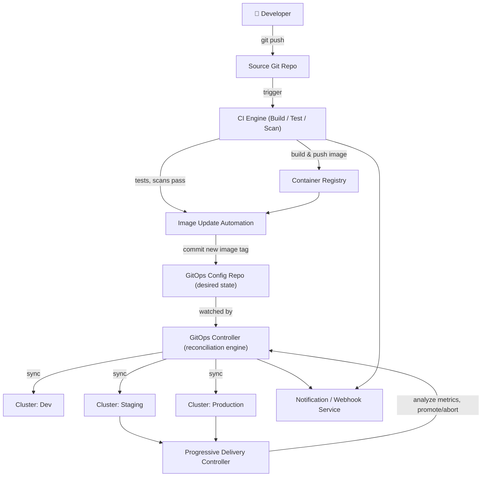
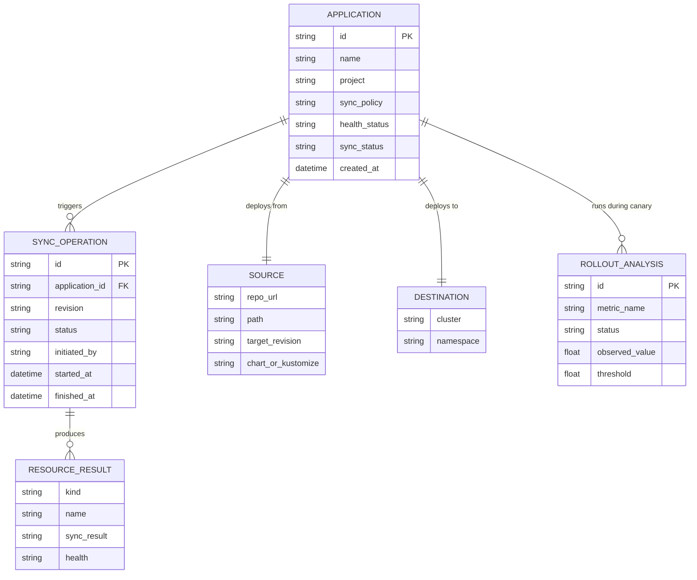
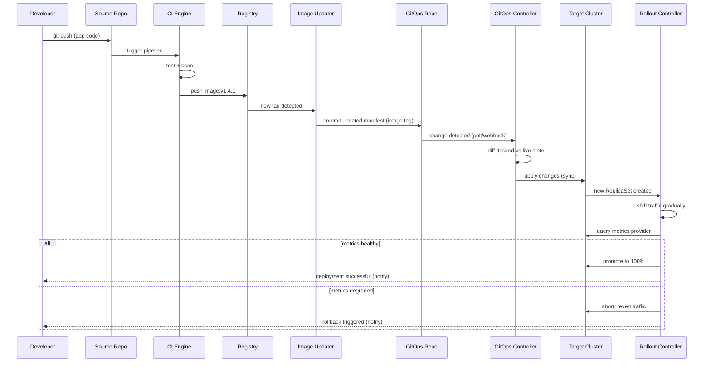
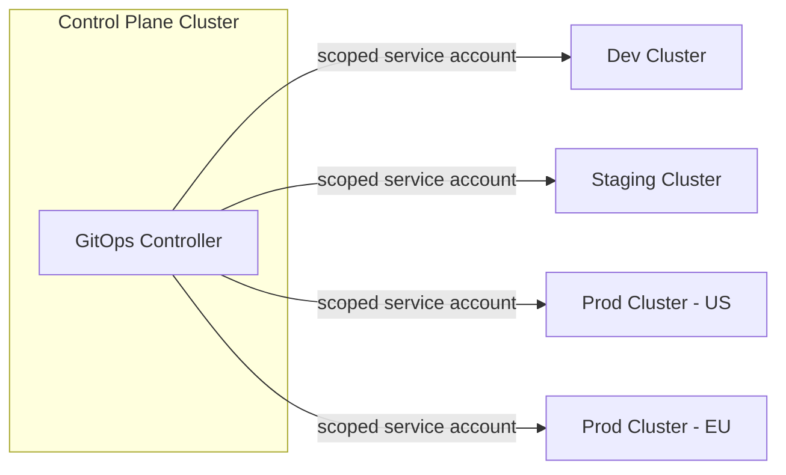

# GitOps-Based CI/CD Platform — Architecture Design Document

**System Type:** Kubernetes-native, Argo-family GitOps CI/CD Platform
**Audience:** Engineering Leadership / Management Review
**Status:** Draft for Review
**Version:** 1.0

---

## Table of Contents

1. [Executive Summary](#1-executive-summary)
2. [Goals & Non-Goals](#2-goals--non-goals)
3. [High-Level Architecture](#3-high-level-architecture)
4. [Core Concepts: CI vs CD Separation](#4-core-concepts-ci-vs-cd-separation)
5. [Core Services — Detailed Design](#5-core-services--detailed-design)
6. [GitOps Repository Structure](#6-gitops-repository-structure)
7. [Data Model](#7-data-model)
8. [End-to-End Workflow](#8-end-to-end-workflow)
9. [Progressive Delivery & Rollback](#9-progressive-delivery--rollback)
10. [Multi-Cluster & Multi-Environment Design](#10-multi-cluster--multi-environment-design)
11. [Security Architecture](#11-security-architecture)
12. [Multi-Tenancy Design](#12-multi-tenancy-design)
13. [Scalability & Capacity Planning](#13-scalability--capacity-planning)
14. [Observability Strategy](#14-observability-strategy)
15. [SLAs, SLOs & Reliability Targets](#15-slas-slos--reliability-targets)
16. [Technology Stack](#16-technology-stack)
17. [Cost Considerations](#17-cost-considerations)
18. [Rollout Plan](#18-rollout-plan)
19. [Risks & Mitigations](#19-risks--mitigations)
20. [Future Enhancements](#20-future-enhancements)
21. [Glossary](#21-glossary)

---

## 1. Executive Summary

This platform provides a **Kubernetes-native, GitOps-driven CI/CD system**: application source code is continuously built and tested by a CI engine, while the *desired state* of every environment is declared as versioned manifests in Git and continuously reconciled onto Kubernetes clusters by a GitOps controller. Git becomes the single source of truth for "what should be running" — not a person, not a pipeline script, not a dashboard click.

**Why this matters for the business:**

| Business Driver | How the System Delivers It |
|---|---|
| Auditability & compliance | Every production change is a Git commit — full history, approvals, diffs |
| Reduced deployment risk | Automatic drift detection + self-healing keeps clusters matching Git |
| Faster, safer releases | Progressive delivery (canary/blue-green) with automated rollback on failure |
| Developer self-service | Teams manage their own app manifests without direct cluster access |
| Multi-cluster consistency | One control plane can manage deployments across many clusters/environments |

This document covers the CI pipeline, the GitOps reconciliation engine, progressive delivery, multi-cluster topology, security, and scaling strategy.

---

## 2. Goals & Non-Goals

### 2.1 Functional Goals

- Build container images from source on commit/PR (CI)
- Run automated tests and security scans as pipeline gates
- Push versioned manifests (desired state) to a Git repository
- Continuously reconcile cluster state to match Git (GitOps CD)
- Detect and auto-correct configuration drift
- Support progressive delivery: canary, blue-green, rolling
- Provide one-click / automatic rollback via Git revert
- Manage deployments across multiple clusters and environments from one control plane
- Give developers self-service visibility without direct `kubectl` access

### 2.2 Non-Functional Goals

| Attribute | Target |
|---|---|
| Declarative & idempotent | Same Git state always produces same cluster state |
| Fault tolerance | Controller restarts never cause missed or duplicate deployments |
| Security | No long-lived cluster credentials outside the GitOps controller |
| Multi-tenancy | Namespace/project-level isolation between teams |
| Observability | Full traceability from commit → image → manifest → live workload |
| Auditability | Every deployment traceable to a Git commit and its author |

### 2.3 Explicit Non-Goals (v1)

- Managing non-Kubernetes deployment targets (VMs, bare metal)
- Building a custom container runtime or scheduler (uses standard Kubernetes)
- Replacing the Git provider's own code review process

---

## 3. High-Level Architecture



**Design principle:** CI and CD are **decoupled by Git**. The CI engine never talks to Kubernetes directly, and the GitOps controller never builds code. The only interface between them is a Git commit — which makes both sides independently scalable, auditable, and replaceable.

---

## 4. Core Concepts: CI vs CD Separation

| | CI (Continuous Integration) | CD (GitOps Continuous Delivery) |
|---|---|---|
| Trigger | Code push / PR | Git commit to config repo |
| Output | Container image + test/scan results | Reconciled Kubernetes state |
| Source of truth | Source code repo | GitOps config repo (manifests/Helm/Kustomize) |
| Push vs Pull | Push-based (pipeline pushes image) | **Pull-based** (controller pulls desired state and applies it) |
| Cluster credentials | None needed | Controller holds scoped, in-cluster credentials only |

The **pull-based model** is the key architectural distinction from traditional push-based CD: no external system needs direct write access to the cluster. The controller running *inside* the cluster pulls the desired state and reconciles — dramatically shrinking the attack surface.

---

## 5. Core Services — Detailed Design

### 5.1 CI Engine

**Responsibilities**
- Trigger on push/PR/tag events
- Execute build steps in isolated, ephemeral containers/workflow pods
- Run unit/integration tests
- Run static analysis and container image vulnerability scans
- Build and push a tagged, immutable container image to the registry
- Emit build metadata (commit SHA, test results, scan report) for traceability

**Typical pipeline stages**

```
Checkout → Install Dependencies → Unit Tests → Build Image
   → Vulnerability Scan → Push to Registry → Emit Build Event
```

A failed scan or test stage **halts the pipeline** — no image is promoted to the GitOps repo.

---

### 5.2 Image Update Automation

**Responsibilities**
- Watch the container registry for new image tags matching a project's policy (e.g., semver, digest, branch-based)
- On a qualifying new image, automatically commit an update to the corresponding manifest field in the GitOps config repo (e.g., bump `image.tag` in a Helm `values.yaml`)
- Support update strategies: automatic (any new tag), semver-constrained, or manual-approval-gated

This is what closes the loop from "CI built a new image" to "CD has something new to deploy" — **without CI ever touching the cluster**.

---

### 5.3 GitOps Controller (Reconciliation Engine)

**Responsibilities**
- Continuously watch one or more Git repositories for desired-state manifests
- Continuously watch live cluster state
- Diff desired vs actual state
- Apply (sync) changes to converge live state to desired state
- Detect drift (manual `kubectl` changes) and optionally auto-heal by reverting to Git state
- Expose sync status, health status, and history per application

**Reconciliation loop**

```
       ┌──────────────────────────────┐
       ▼                              │
  Watch Git Repo                      │
       │                              │
       ▼                              │
  Render Manifests (Helm/Kustomize)   │
       │                              │
       ▼                              │
  Diff vs Live Cluster State          │
       │                              │
       ▼                              │
  Out of Sync? ──No──► Sleep/Watch ───┘
       │
      Yes
       ▼
  Apply Changes (Sync)
       │
       ▼
  Run Health Checks
       │
       ▼
  Update Application Status
```

**Sync policies**
- **Manual sync:** changes are staged and require explicit approval before applying (common for production)
- **Automated sync:** any Git change is applied immediately (common for dev/staging)
- **Self-heal:** any manual drift detected in the cluster is automatically reverted to match Git

---

### 5.4 Progressive Delivery Controller

**Responsibilities**
- Implement canary, blue-green, and rolling update strategies as a Kubernetes-native resource
- Gradually shift traffic to the new version while querying a metrics provider (Prometheus, Datadog, etc.)
- Automatically **promote** if success metrics (latency, error rate) stay within threshold
- Automatically **abort and roll back** if metrics breach threshold

```
New Version Deployed (0% traffic)
   ↓
Shift 10% traffic → Analyze metrics (pass?) 
   ↓ yes                              ↓ no
Shift 50% traffic → Analyze         Abort, revert to 0%,
   ↓ yes                            restore prior version
Shift 100% traffic → Promote Stable
```

---

### 5.5 Notification / Webhook Service

**Responsibilities**
- Emit events on sync start/success/failure, health degradation, and rollback
- Deliver to Slack, email, or generic webhooks
- Provide the audit trail hook for compliance systems

---

## 6. GitOps Repository Structure

A typical **environment-per-directory** layout, using Kustomize overlays (Helm-based layouts follow the same principle with `values-{env}.yaml`):

```
gitops-config-repo/
├── apps/
│   └── payments-service/
│       ├── base/
│       │   ├── deployment.yaml
│       │   ├── service.yaml
│       │   └── kustomization.yaml
│       └── overlays/
│           ├── dev/
│           │   └── kustomization.yaml   (image tag: dev-latest)
│           ├── staging/
│           │   └── kustomization.yaml   (image tag: v1.4.0-rc2)
│           └── production/
│               └── kustomization.yaml   (image tag: v1.3.2)
```

**Why this matters:** promoting a change from staging to production is literally a Git diff + merge between overlay directories — fully reviewable, fully auditable, no side channel.

---

## 7. Data Model



---

## 8. End-to-End Workflow



---

## 9. Progressive Delivery & Rollback

### 9.1 Rollback Is a Git Operation

Because the cluster state is always a reflection of Git, rollback in the simple case is:

```
git revert <bad-commit>  →  push  →  GitOps Controller detects change  →  reconciles cluster back to prior state
```

No rebuild, no manual `kubectl` surgery — the same reconciliation loop used for forward deploys handles rollback.

### 9.2 Automated Rollback (Progressive Delivery)

For canary/blue-green strategies, rollback can be **fully automatic**, driven by real-time metric analysis rather than waiting for a human to notice:

| Trigger | Action |
|---|---|
| Error rate exceeds threshold during canary | Automatic abort, traffic reverted to stable version |
| Latency (p95/p99) regression detected | Automatic abort |
| Manual "abort" from operator | Immediate traffic revert |
| Health check / readiness probe failures | Rollout paused, no further traffic shift |

---

## 10. Multi-Cluster & Multi-Environment Design

- A single GitOps control plane can manage **many target clusters** (dev, staging, prod, per-region, per-tenant) from one place.
- Each `Application` resource declares its own `(source repo/path, target cluster, target namespace)` triple — cluster credentials are registered once and reused across many applications.
- **Hub-and-spoke topology:** the control plane cluster hosts the GitOps controller; target/workload clusters only need an inbound-restricted service account with least-privilege RBAC — no outbound access to the control plane is required from workload clusters (pull model).
- Environments are promoted via Git merges between overlay directories (§6), not by re-running pipelines against different targets.



---

## 11. Security Architecture

### 11.1 Credential Model

- The GitOps controller holds the **only** long-lived cluster credentials (scoped service accounts, least-privilege RBAC per namespace/project)
- CI pipelines hold **zero** cluster credentials — they only need registry push access
- Developers interact via Git commits and the platform UI/API, not direct `kubectl` access to production

### 11.2 Supply Chain Security

- Every image is scanned for vulnerabilities before it can be referenced in the GitOps repo
- Image signing (e.g., cosign/Sigstore) and admission-time signature verification prevent unsigned/untrusted images from being deployed
- SBOM generation per build for compliance and vulnerability tracing

### 11.3 Access Control

- **Git-level:** branch protection + mandatory PR review on the GitOps repo *is* the production change-approval process
- **Platform-level:** project/namespace-scoped RBAC controlling who can trigger manual syncs, view secrets, or approve production promotions
- **Secrets:** never stored in plaintext in Git — integrated with an external secrets manager (Vault, cloud KMS) and injected at reconcile/runtime only

### 11.4 Threat Model Summary

| Threat | Control |
|---|---|
| Compromised CI pipeline pushes malicious manifest | CI cannot write to cluster; only commits to Git, which still requires PR review to reach production overlay |
| Cluster drift via manual `kubectl` | Self-heal reverts unauthorized changes automatically |
| Credential sprawl across many pipelines | Single controller holds cluster creds; pipelines hold none |
| Unsigned/vulnerable image deployed | Admission-controller signature + scan-gate enforcement |
| Secret leakage in Git | External secrets manager; secrets never committed in plaintext |

---

## 12. Multi-Tenancy Design

- **Isolation boundary:** Project → Application → Namespace/Cluster
- Each tenant (team) is scoped to a **Project**, which restricts which Git repos, clusters, and namespaces its applications may target
- RBAC roles are assignable per project, enabling self-service without cross-tenant blast radius
- Resource quotas at the namespace level prevent one tenant's workloads from starving another's

---

## 13. Scalability & Capacity Planning

| Metric | Guideline |
|---|---|
| Applications per controller instance | Scale controller replicas / shard by cluster as application count grows |
| Reconciliation interval | Default poll (e.g., 3 min) + webhook-triggered immediate sync for low latency |
| CI concurrency | Ephemeral, auto-scaled build runners/workflow pods, scaled by queue depth |
| Target clusters per control plane | Horizontally add via cluster registration; no architectural cap |
| Git repo polling load | Prefer webhook-driven notification over aggressive polling at scale |

**Scaling principle:** the CI engine scales with *commit volume*; the GitOps controller scales with *number of applications and clusters managed*, not with commit volume — the two workloads have different scaling curves and are provisioned independently.

---

## 14. Observability Strategy

### 14.1 Key Metrics

| Category | Metrics |
|---|---|
| CI | Build duration, test pass rate, scan pass rate, queue wait time |
| CD Sync | Sync duration, sync success/failure rate, drift-detection frequency |
| Rollout | Canary promotion rate, automatic rollback rate, analysis run duration |
| Cluster | Application health status distribution, out-of-sync application count |

### 14.2 Traceability

Every deployment is traceable end-to-end via a shared correlation ID: **commit SHA → image digest → GitOps commit → sync operation → live Kubernetes resources.** This chain is the backbone of both debugging and compliance audit trails.

### 14.3 Dashboards

- Real-time application health/sync-status grid across all managed clusters
- Rollout progress visualization (traffic-shift percentage, live metric analysis)
- Audit log view: who changed what, when, and which commit caused it

---

## 15. SLAs, SLOs & Reliability Targets

| Metric | Target |
|---|---|
| GitOps controller availability | 99.9% |
| Time from Git commit to sync start (webhook-driven) | < 30 seconds |
| Drift detection & self-heal time | < 5 minutes |
| Automated rollback time (progressive delivery abort) | < 2 minutes |
| CI pipeline success rate (excluding user code errors) | ≥ 99.5% |

---

## 16. Technology Stack

| Component | Suggested Technology |
|---|---|
| CI Engine | Workflow-based CI (Kubernetes-native jobs/pods) |
| GitOps Controller | Declarative, pull-based Kubernetes GitOps operator |
| Progressive Delivery | Canary/blue-green controller integrated with metrics provider |
| Container Registry | OCI-compliant registry (Harbor, ECR, GCR, etc.) |
| Secrets Management | Vault or cloud-native KMS + external secrets operator |
| Metrics Provider | Prometheus + Grafana |
| Image Signing | Sigstore/cosign |
| Notification | Webhook/Slack/email integrations |
| Source Control | Git (GitHub/GitLab/Bitbucket-compatible) |

---

## 17. Cost Considerations

- **CI compute** scales with commit/build volume — ephemeral runners keep idle cost near zero.
- **GitOps controller** is a small, steady-state control-plane cost independent of deployment frequency — it scales with number of applications/clusters, not commit volume.
- **Registry storage** cost is controlled via image retention/garbage-collection policies (keep last N tags per app).
- **Cross-cluster/cross-region egress** for multi-cluster topologies should be tracked separately, especially for image pulls across regions.

---

## 18. Rollout Plan

| Phase | Scope |
|---|---|
| Phase 1 — Pilot | One team, dev + staging clusters only, manual sync policy |
| Phase 2 — Expansion | Add production cluster, automated sync for non-prod, manual-approval sync for prod |
| Phase 3 — Progressive Delivery | Enable canary/blue-green for production workloads with metric-based auto-rollback |
| Phase 4 — Platform-Wide | Multi-cluster/multi-region, self-service project onboarding, full RBAC + audit compliance |

---

## 19. Risks & Mitigations

| Risk | Impact | Mitigation |
|---|---|---|
| GitOps repo becomes a bottleneck (large monorepo) | Slow reconciliation, contentious PRs | Per-app or per-team repo/directory sharding |
| Config drift between environments | Inconsistent behavior across envs | Base + overlay pattern keeps environments DRY and diffable |
| Over-permissive controller service account | Large blast radius if compromised | Least-privilege, namespace-scoped RBAC per project |
| Canary analysis false positives/negatives | Bad releases promoted, or good ones blocked | Tune metric thresholds; require multiple consecutive healthy checks |
| Secret sprawl in manifests | Security incident | Mandatory external secrets integration; block plaintext secrets via policy/admission control |

---

## 20. Future Enhancements

- Automated progressive delivery for **all** production workloads, not opt-in
- Policy-as-code admission control (e.g., OPA/Kyverno) enforced pre-sync
- Cost-aware scheduling recommendations surfaced in the platform UI
- Cross-region disaster-recovery failover automation via GitOps
- Self-service environment provisioning (ephemeral preview environments per PR)
- Deeper supply-chain attestation (in-toto / SLSA compliance level tracking)

---

## 21. Glossary

| Term | Definition |
|---|---|
| GitOps | Operating model where Git is the single source of truth for desired system state, reconciled continuously by an automated controller |
| Reconciliation | The continuous process of diffing and converging live state to match declared desired state |
| Drift | Divergence between live cluster state and the state declared in Git |
| Self-Heal | Automatic reversion of drift back to the Git-declared state |
| Canary Release | Gradually shifting traffic to a new version while monitoring health metrics |
| Blue-Green Deployment | Running two full environments and switching traffic atomically between them |
| Pull-Based Deployment | Deployment model where the controller inside the cluster pulls desired state, rather than an external system pushing changes in |
| SBOM | Software Bill of Materials — manifest of all components in a built artifact |

---

*End of document.*
