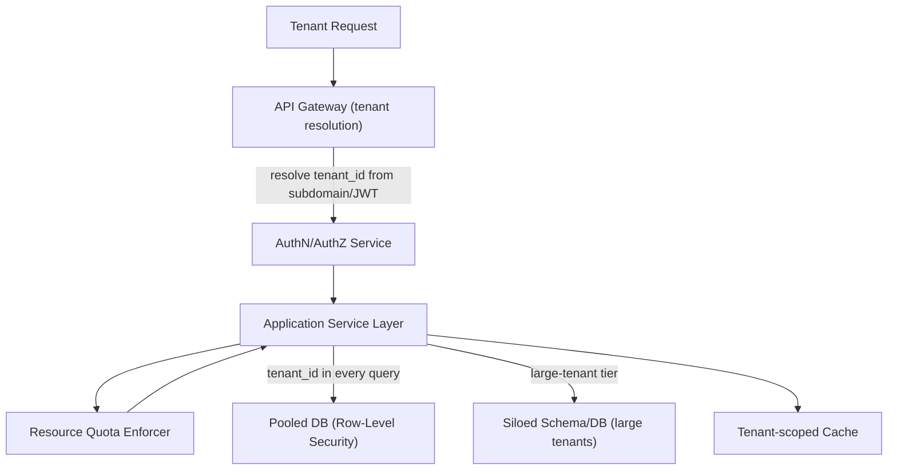
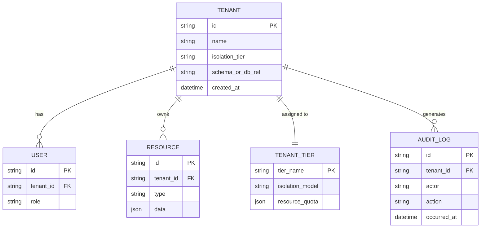
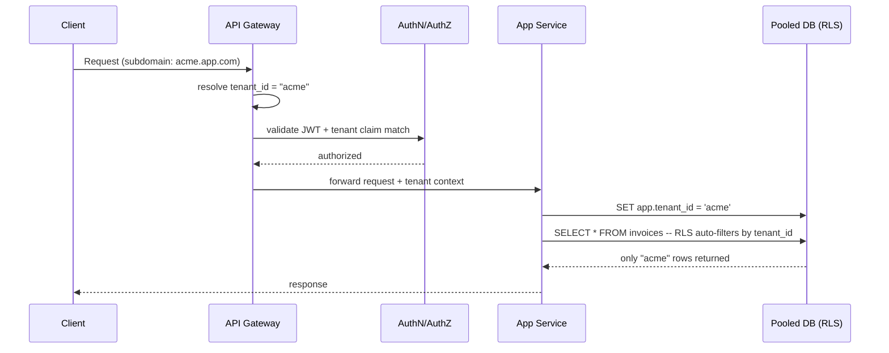

# Multi-Tenant SaaS Data Isolation Architecture

**Version:** 1.0 | **Audience:** Engineering Leadership / Architecture Review

---

## Table of Contents
1. [Executive Summary](#1-executive-summary)
2. [Goals & Non-Goals](#2-goals--non-goals)
3. [Tenancy Models Overview](#3-tenancy-models-overview)
4. [High-Level Architecture](#4-high-level-architecture)
5. [Core Components](#5-core-components)
6. [Data Model](#6-data-model)
7. [Request Isolation Workflow](#7-request-isolation-workflow)
8. [Security Architecture](#8-security-architecture)
9. [Noisy-Neighbor & Resource Isolation](#9-noisy-neighbor--resource-isolation)
10. [Scalability & Capacity Planning](#10-scalability--capacity-planning)
11. [Observability Strategy](#11-observability-strategy)
12. [Technology Stack](#12-technology-stack)
13. [Risks & Mitigations](#13-risks--mitigations)
14. [Future Enhancements](#14-future-enhancements)
15. [Glossary](#15-glossary)

---

## 1. Executive Summary

A multi-tenant SaaS platform serves many customers ("tenants") from shared infrastructure while guaranteeing that **no tenant can ever access, infer, or degrade another tenant's data or performance**. This document defines the isolation model spanning data storage, compute, and request routing — the foundation that compliance, security review, and enterprise sales all depend on.

| Business Driver | How the Architecture Delivers It |
|---|---|
| Enterprise trust & compliance | Provable, enforced tenant data isolation (SOC 2 / ISO 27001 friendly) |
| Cost efficiency | Shared infrastructure instead of per-tenant deployments |
| Operational simplicity | One codebase/deployment to manage instead of N tenant silos |
| Scale to large tenants | Tiered isolation model allows "graduating" large tenants to stronger isolation |

---

## 2. Goals & Non-Goals

### Functional Goals
- Enforce tenant data isolation at the database layer, not just application logic
- Support tiered isolation (shared pool → siloed schema → dedicated instance) by plan/tier
- Prevent cross-tenant data leakage even under application-layer bugs
- Provide per-tenant resource quotas to prevent noisy-neighbor impact

### Non-Functional Goals
| Attribute | Target |
|---|---|
| Isolation strength | Defense-in-depth: enforced at DB + app + network layers |
| Scalability | Support tens of thousands of tenants on shared pools |
| Auditability | Every cross-tenant-adjacent query logged and reviewable |
| Migration flexibility | Tenant can move between isolation tiers without downtime |

### Non-Goals (v1)
- Per-tenant custom infrastructure (VPC-per-tenant) outside the "dedicated" tier
- Cross-tenant data sharing/collaboration features (separate initiative)

---

## 3. Tenancy Models Overview

| Model | Description | Isolation Strength | Cost Efficiency |
|---|---|---|---|
| **Pooled (shared schema, tenant_id column)** | All tenants share tables; every row scoped by `tenant_id` | Lowest (relies on query discipline + RLS) | Highest |
| **Siloed schema (schema-per-tenant)** | Same database instance, separate schema per tenant | Medium | Medium |
| **Siloed database (database-per-tenant)** | Separate database instance per tenant | High | Lower |
| **Dedicated infrastructure** | Fully separate compute + storage stack | Highest | Lowest |

**Recommended default:** pooled model with **Row-Level Security (RLS)** enforced at the database engine for small/mid tenants; large/regulated tenants graduate to siloed database or dedicated tier.

---

## 4. High-Level Architecture

**Design principle:** the tenant identifier is resolved **once**, at the edge (subdomain, JWT claim, or API key), and propagated through every downstream call — no service is allowed to trust a tenant ID passed in a request body without cross-checking the authenticated context.

---

## 5. Core Components

### 5.1 Tenant Resolution (API Gateway)
- Resolves `tenant_id` from subdomain, custom domain mapping, or signed JWT claim
- Rejects any request where the resolved tenant doesn't match the authenticated principal's tenant

### 5.2 Row-Level Security (Pooled Tier)
- Database-enforced policy: every query is automatically filtered by the current session's `tenant_id`
- Enforced **at the database engine**, not just application code — so even a buggy or compromised application query cannot cross tenant boundaries
- Application sets `tenant_id` as a session variable at the start of each request/connection

### 5.3 Siloed Schema/Database (Growth Tier)
- Each qualifying tenant gets a dedicated schema or database
- Connection routing layer selects the correct schema/database based on resolved tenant
- Enables per-tenant backup/restore and easier "right to be forgotten" compliance

### 5.4 Tenant-Scoped Cache
- Cache keys always prefixed with `tenant_id` (`tenant:{id}:resource:{key}`)
- Prevents cache poisoning from leaking data across tenants

### 5.5 Resource Quota Enforcer
- Per-tenant rate limits, concurrency caps, and storage quotas
- Enforced at the gateway (request rate) and at the database/compute layer (query concurrency, storage size)

---

## 6. Data Model

Every business table includes `tenant_id` as a **mandatory, indexed, non-nullable** column — enforced by schema constraint, not convention.

---

## 7. Request Isolation Workflow

---

## 8. Security Architecture

- **Defense-in-depth:** tenant scoping enforced at gateway, application, and database layers independently — any single-layer bug is contained by the other two
- **Row-Level Security policies** are the last line of defense and cannot be bypassed by application code
- **Encryption:** per-tenant encryption keys for the "dedicated" tier; shared envelope encryption with tenant-scoped data keys for pooled tiers
- **Audit logging:** every data access logged with tenant context; anomalous cross-tenant access patterns alert automatically

---

## 9. Noisy-Neighbor & Resource Isolation

| Layer | Mechanism |
|---|---|
| API rate limiting | Per-tenant request quotas at the gateway |
| Database | Per-tenant connection pool caps; query timeout enforcement |
| Compute | Namespace/pod-level resource quotas for siloed/dedicated tenants |
| Storage | Per-tenant storage quota with soft/hard limits and alerts |

---

## 10. Scalability & Capacity Planning

| Metric | Guideline |
|---|---|
| Tenants per pooled database | Sized to keep p99 query latency within SLO; shard pool when threshold reached |
| Schema/DB-per-tenant limit | Bounded by connection pool and metadata overhead — plan sharding strategy beyond ~thousands of tenants |
| Tier migration | Online migration tooling to move a tenant from pooled → siloed without downtime |

---

## 11. Observability Strategy

- Per-tenant dashboards: request volume, error rate, latency, storage usage
- Cross-tenant query attempt = critical security alert (should be near-zero in normal operation)
- Tenant-level cost attribution for usage-based billing

---

## 12. Technology Stack

| Component | Suggested Technology |
|---|---|
| Database (RLS) | PostgreSQL (native Row-Level Security) |
| Cache | Redis (tenant-prefixed keys) |
| API Gateway | Kong / Envoy / cloud-native API Gateway |
| Secrets/Keys | Per-tenant KMS data keys |
| Observability | Prometheus + Grafana, per-tenant labeled metrics |

---

## 13. Risks & Mitigations

| Risk | Mitigation |
|---|---|
| Missing `tenant_id` filter in a new query | RLS enforced at DB engine catches it regardless of app code |
| Large tenant degrades shared pool performance | Quotas + proactive tier-migration triggers based on usage |
| Cache key collision across tenants | Mandatory tenant-prefixed key convention, enforced via shared cache client wrapper |
| Compliance requirement for full physical isolation | Dedicated tier available as an upsell/compliance path |

---

## 14. Future Enhancements

- Automated tier-migration recommendations based on usage patterns
- Per-tenant data residency (region pinning) for regulatory compliance
- Self-service tenant data export/deletion (GDPR/CCPA automation)
- Tenant-level chaos testing to verify isolation boundaries continuously

---

## 15. Glossary

| Term | Definition |
|---|---|
| Tenant | A customer/organization using the shared SaaS platform |
| Row-Level Security (RLS) | Database-enforced filtering of rows based on session context |
| Noisy Neighbor | A tenant whose usage degrades performance for others sharing infrastructure |
| Pooled Tenancy | Multiple tenants sharing the same tables/schema |
| Siloed Tenancy | Each tenant has a dedicated schema or database |

---
*End of document.*
