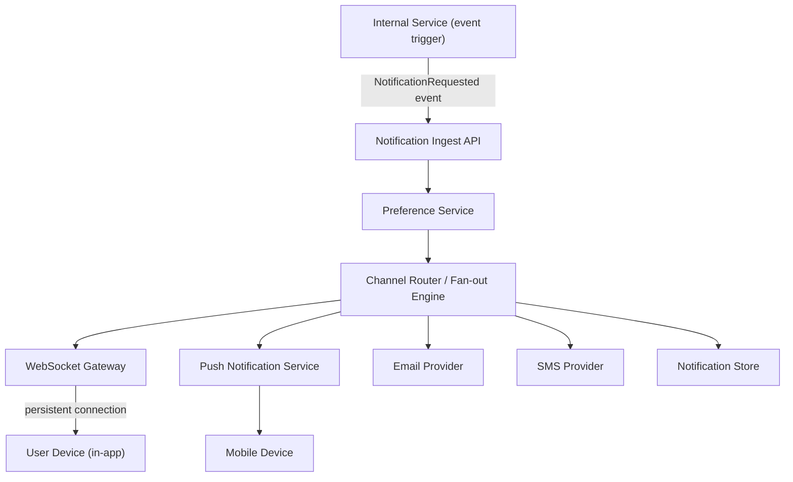
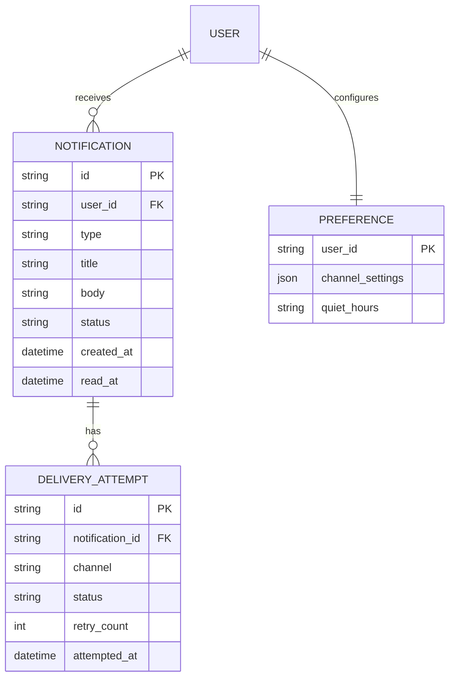
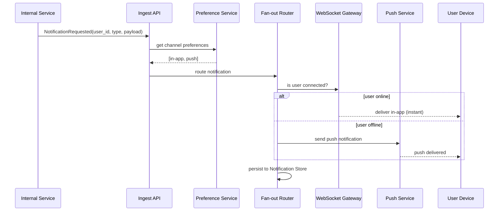

# Real-Time Notification & Messaging Platform Architecture

**Version:** 1.0 | **Audience:** Engineering Leadership / Architecture Review

---

## Table of Contents
1. [Executive Summary](#1-executive-summary)
2. [Goals & Non-Goals](#2-goals--non-goals)
3. [High-Level Architecture](#3-high-level-architecture)
4. [Core Components](#4-core-components)
5. [Data Model](#5-data-model)
6. [End-to-End Delivery Workflow](#6-end-to-end-delivery-workflow)
7. [Delivery Guarantees & Failure Recovery](#7-delivery-guarantees--failure-recovery)
8. [Security Architecture](#8-security-architecture)
9. [Scalability & Capacity Planning](#9-scalability--capacity-planning)
10. [Observability Strategy](#10-observability-strategy)
11. [Technology Stack](#11-technology-stack)
12. [Risks & Mitigations](#12-risks--mitigations)
13. [Future Enhancements](#13-future-enhancements)
14. [Glossary](#14-glossary)

---

## 1. Executive Summary

The **real-time notification platform** delivers events to users across multiple channels — in-app (WebSocket/push), mobile push, email, and SMS — with per-user preference management, delivery guarantees, and fan-out at scale. It decouples "something happened" from "how the user is told about it."

| Business Driver | How the Architecture Delivers It |
|---|---|
| User engagement | Instant in-app/push delivery for time-sensitive events |
| Channel flexibility | Single event triggers the right channel(s) per user preference |
| Reliability | Guaranteed delivery with retry/fallback across channels |
| Scale | Fan-out architecture handles broadcast-to-millions scenarios (e.g., platform-wide announcements) |

---

## 2. Goals & Non-Goals

### Functional Goals
- Accept notification-trigger events from any internal service
- Fan out to appropriate channels based on per-user preferences
- Support real-time in-app delivery (WebSocket) and push/email/SMS
- Deduplicate and rate-limit notifications to prevent user fatigue
- Track delivery and read/open status per notification

### Non-Functional Goals
| Attribute | Target |
|---|---|
| Latency (in-app) | Sub-second delivery for connected clients |
| Delivery guarantee | At-least-once, with idempotent client-side handling |
| Scalability | Support broadcast fan-out to millions of recipients |
| Multi-tenancy | Per-tenant rate limits and branding for outbound channels |

### Non-Goals (v1)
- Rich marketing campaign orchestration (drip campaigns) — separate marketing platform
- In-house SMS/email delivery infrastructure — uses third-party providers

---

## 3. High-Level Architecture

**Design principle:** producers emit a single, channel-agnostic notification event; the router resolves it into zero, one, or many actual channel deliveries based on user preferences — producers never hardcode "send an email."

---

## 4. Core Components

### 4.1 Notification Ingest API
- Accepts notification requests from internal services (`user_id`, `template`, `payload`)
- Validates and enqueues for processing; decouples producer from delivery latency

### 4.2 Preference Service
- Stores per-user, per-notification-type channel preferences (in-app only, push+email, muted, etc.)
- Enforces quiet hours and frequency capping rules

### 4.3 Channel Router / Fan-out Engine
- Resolves which channels to use per notification based on preferences
- For broadcast notifications (e.g., "maintenance window"), fans out efficiently to large recipient lists via batched processing

### 4.4 WebSocket Gateway
- Maintains persistent connections for online users
- Delivers in-app notifications instantly; falls back to push/email if user is offline

### 4.5 Push / Email / SMS Providers
- Integrates with third-party delivery providers (APNs/FCM for push, transactional email/SMS providers)
- Handles provider-specific retry and bounce/failure handling

### 4.6 Notification Store
- Persists notification history for in-app notification center, read/unread state, and delivery audit

---

## 5. Data Model

---

## 6. End-to-End Delivery Workflow

---

## 7. Delivery Guarantees & Failure Recovery

| Scenario | Behavior |
|---|---|
| User offline for in-app delivery | Falls back to push/email per preference; notification persisted for next login |
| Push provider failure | Retry with backoff; fallback to email if push repeatedly fails |
| WebSocket Gateway node failure | Client reconnects to another gateway node; missed notifications delivered from store on reconnect |
| Duplicate event from producer | Idempotency key (`notification_id` derived from source event) prevents duplicate delivery |
| Broadcast to millions | Batched, rate-limited fan-out to avoid overwhelming downstream providers |

---

## 8. Security Architecture

- WebSocket connections authenticated via short-lived token exchanged at connection time
- Per-tenant sending reputation isolation (one tenant's spam complaints don't affect another's email deliverability)
- PII in notification payloads encrypted at rest in the Notification Store
- Rate limiting per user and per tenant to prevent notification abuse/spam vectors

---

## 9. Scalability & Capacity Planning

| Metric | Guideline |
|---|---|
| WebSocket connections per gateway node | Sized to connection/memory limits; horizontally scaled with sticky routing or connection-state externalized |
| Fan-out batch size | Tuned to balance latency vs. provider rate limits for broadcast sends |
| Notification store growth | Retention policy + archival for old read notifications |

---

## 10. Observability Strategy

- Delivery success rate per channel, tracked separately (in-app vs push vs email vs SMS)
- End-to-end latency from event trigger to delivery confirmation
- Bounce/complaint rate monitoring for email/SMS deliverability health

---

## 11. Technology Stack

| Component | Suggested Technology |
|---|---|
| Ingest / Queue | Kafka or a managed message queue |
| WebSocket Gateway | Node.js/Go WebSocket service behind a load balancer with sticky sessions |
| Push | FCM (Android), APNs (iOS) |
| Email | Transactional email provider (SES, SendGrid, etc.) |
| SMS | Twilio or equivalent |
| Store | PostgreSQL / DynamoDB for notification history |

---

## 12. Risks & Mitigations

| Risk | Mitigation |
|---|---|
| Notification fatigue / user opt-out | Frequency capping and digest bundling for non-urgent notification types |
| Provider outage (push/email/SMS) | Multi-provider fallback chain configured per channel |
| WebSocket connection storms on deploy | Graceful connection draining and staggered reconnect backoff |
| PII leakage in notification payload | Payload field-level encryption + data classification review before new notification types ship |

---

## 13. Future Enhancements

- Notification digesting/bundling for lower-priority events
- Rich in-app notification center with actions (approve/deny inline)
- ML-based send-time optimization per user
- Cross-channel deduplication (don't push AND email the same event within a short window)

---

## 14. Glossary

| Term | Definition |
|---|---|
| Fan-out | Distributing a single event to many recipients/channels |
| Quiet Hours | User-configured time window during which non-urgent notifications are suppressed |
| Channel | Delivery medium: in-app, push, email, SMS |
| Delivery Attempt | A single try to deliver a notification via a specific channel |

---
*End of document.*
