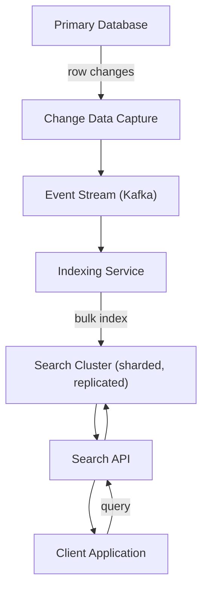
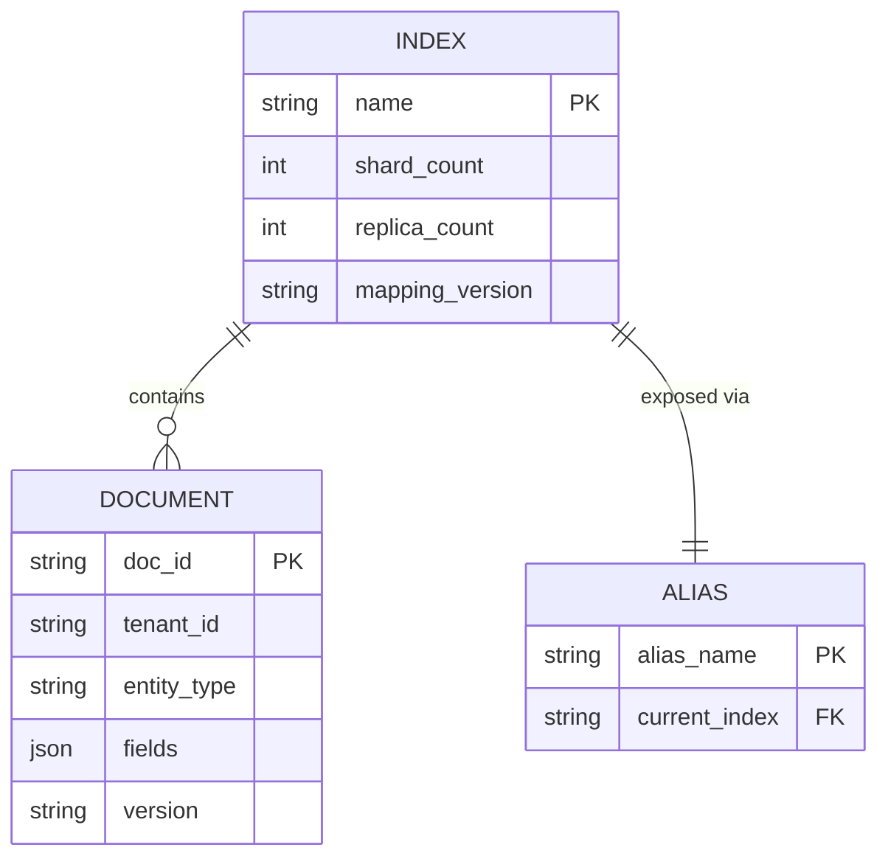
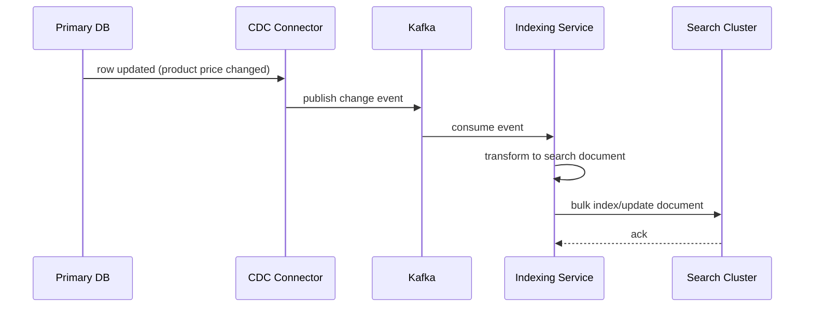
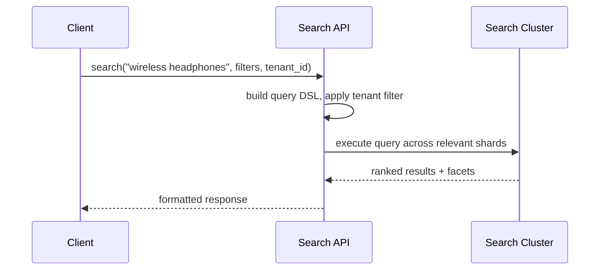

# Search & Indexing Platform Architecture (Elasticsearch-based)

**Version:** 1.0 | **Audience:** Engineering Leadership / Architecture Review

---

## Table of Contents
1. [Executive Summary](#1-executive-summary)
2. [Goals & Non-Goals](#2-goals--non-goals)
3. [High-Level Architecture](#3-high-level-architecture)
4. [Core Components](#4-core-components)
5. [Data Model / Index Design](#5-data-model--index-design)
6. [Indexing Workflow](#6-indexing-workflow)
7. [Query Workflow](#7-query-workflow)
8. [Failure Recovery & Consistency](#8-failure-recovery--consistency)
9. [Security Architecture](#9-security-architecture)
10. [Scalability & Capacity Planning](#10-scalability--capacity-planning)
11. [Observability Strategy](#11-observability-strategy)
12. [Technology Stack](#12-technology-stack)
13. [Risks & Mitigations](#13-risks--mitigations)
14. [Future Enhancements](#14-future-enhancements)
15. [Glossary](#15-glossary)

---

## 1. Executive Summary

The **search & indexing platform** provides fast, relevant, faceted search over the platform's primary data (products, documents, users, etc.) without burdening the transactional database with complex full-text queries. Data changes flow asynchronously from the system of record into a purpose-built search index via CDC, keeping the search experience fast while the primary database stays focused on transactional correctness.

| Business Driver | How the Architecture Delivers It |
|---|---|
| Fast, relevant search | Purpose-built inverted-index engine, not ad-hoc SQL `LIKE` queries |
| Database protection | Search load isolated from the transactional primary database |
| Rich query capability | Faceting, fuzzy matching, ranking, autocomplete out of the box |
| Near-real-time freshness | CDC-based indexing keeps search results current within seconds |

---

## 2. Goals & Non-Goals

### Functional Goals
- Index data from the system of record with near-real-time freshness
- Support full-text search, filtering, faceting, and relevance ranking
- Support autocomplete/typeahead and fuzzy/typo-tolerant matching
- Provide per-tenant index isolation for multi-tenant search

### Non-Functional Goals
| Attribute | Target |
|---|---|
| Query latency | Sub-100ms p95 for typical queries |
| Indexing lag | Data searchable within seconds of the source change |
| Availability | Search cluster survives node failure without downtime |
| Multi-tenancy | Tenant data isolated at index or alias level |

### Non-Goals (v1)
- Using the search index as the system of record (source of truth remains the primary DB)
- Real-time analytics/BI (handled by a separate data warehouse)

---

## 3. High-Level Architecture

**Design principle:** the search index is a **derived, rebuildable** view of the primary database, kept in sync asynchronously via CDC — never written to directly by application business logic.

---

## 4. Core Components

### 4.1 Change Data Capture (CDC)
- Streams row-level changes (insert/update/delete) from the primary database transaction log
- Decouples indexing from application code — no dual-write risk

### 4.2 Event Stream
- Buffers change events, allowing the indexing service to consume at its own pace
- Enables replay for full reindexing without touching the primary database again

### 4.3 Indexing Service
- Transforms database rows into search documents (denormalization, field mapping)
- Applies bulk indexing for throughput efficiency
- Handles per-tenant routing to the correct index/alias

### 4.4 Search Cluster
- Sharded and replicated inverted-index engine
- Shards distribute data and query load; replicas provide HA and read scaling

### 4.5 Search API
- Query DSL abstraction layer for client applications
- Handles relevance tuning, pagination, faceting, and result highlighting

---

## 5. Data Model / Index Design

**Index-per-tenant vs. shared index with tenant filter:** small tenants share an index with a mandatory `tenant_id` filter; large tenants get dedicated indices for isolation and independent scaling — mirroring the tiered approach used in the multi-tenant data isolation document.

**Zero-downtime reindexing pattern:** build a new index version, backfill from the event stream, then atomically flip the alias — clients querying via the alias never see a gap.

---

## 6. Indexing Workflow

---

## 7. Query Workflow

---

## 8. Failure Recovery & Consistency

| Scenario | Behavior |
|---|---|
| Search cluster node failure | Replica shards promoted; query availability maintained, brief indexing lag possible |
| Indexing service crash | Event stream retains unprocessed events; indexer resumes from last committed offset, no data loss |
| Index corruption / bad mapping deploy | Rebuild from event stream replay into a new index, then alias swap — no primary DB impact |
| CDC connector lag spike | Search freshness degrades temporarily but self-heals as connector catches up; alert on lag threshold |

**Consistency model:** eventual consistency between primary DB and search index, with typical indexing lag in the low seconds — acceptable for search use cases, explicitly not used where read-your-write guarantees are required.

---

## 9. Security Architecture

- Search cluster network-isolated, not directly internet-exposed — all access via the Search API
- Tenant filter enforced server-side in the Search API, never trusted from client-supplied parameters
- Field-level security to exclude sensitive fields from being indexed/searchable at all
- Query rate limiting per tenant/API key to prevent abuse

---

## 10. Scalability & Capacity Planning

| Metric | Guideline |
|---|---|
| Shard count | Sized so each shard stays within recommended size limits (avoid over-sharding small indices) |
| Replica count | At least 1 replica per shard for HA; more for read-heavy scaling |
| Indexing throughput | Bulk batch size tuned for cluster ingest capacity vs. freshness requirements |
| Cluster scaling | Add data nodes horizontally as index size/query load grows |

---

## 11. Observability Strategy

- Indexing lag (time from DB change to searchable) is the key freshness metric
- Query latency (p50/p95/p99) and error rate per index
- Cluster health (shard allocation status, node resource utilization)
- Slow-query logging for relevance/performance tuning

---

## 12. Technology Stack

| Component | Suggested Technology |
|---|---|
| Search Engine | Elasticsearch / OpenSearch |
| CDC | Debezium |
| Event Stream | Kafka |
| Search API Layer | Custom service wrapping the query DSL |
| Monitoring | Prometheus + Grafana, cluster-native monitoring APIs |

---

## 13. Risks & Mitigations

| Risk | Mitigation |
|---|---|
| Search index drifts from source of truth | CDC-based sync + periodic reconciliation job comparing counts/checksums |
| Mapping change breaks existing queries | Alias-based zero-downtime reindexing pattern |
| Hot shard from skewed tenant data volume | Dedicated index tier for large tenants; shard routing review |
| Relevance regressions after tuning changes | A/B test relevance changes before full rollout |

---

## 14. Future Enhancements

- Vector/semantic search alongside traditional full-text (hybrid search)
- Personalized ranking based on user behavior signals
- Multi-region search cluster replication for global latency
- Self-service relevance tuning dashboard for product teams

---

## 15. Glossary

| Term | Definition |
|---|---|
| Inverted Index | Data structure mapping terms to the documents containing them, enabling fast full-text search |
| Shard | A horizontal partition of an index, distributing data and query load |
| Alias | A named pointer to one or more indices, enabling zero-downtime index swaps |
| CDC | Change Data Capture — streaming database changes as events |
| Faceting | Aggregated counts of result attributes (e.g., "Brand: Nike (24)") used for filtering UIs |

---
*End of document.*
